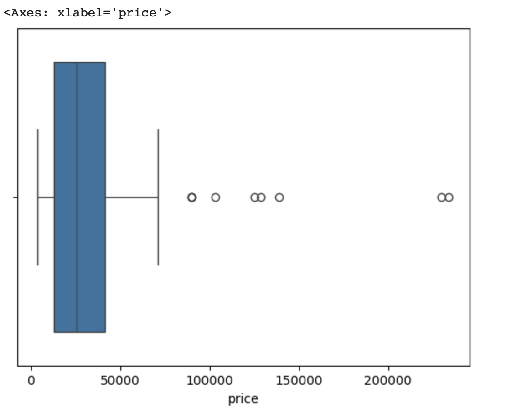

Introduction to Exploratory Data Analysis and Pre-Processing
=============================================================

As we will emphasize throughout the semester, having a basic familiarity and 
understanding of the dataset you are working with will be important for making 
decisions about what and how to analyze it, and the success of machine learning algorithms
will depend in large part on having prepared the data to ensure it has certain qualities. 

In this unit, we introduce an initial set of data analysis and pre-processing 
techniques. This is just a starting point -- we will introduce additional topics 
throughout the semester. 

By the end of this module, students should be able to:

1. Investigate the shape and types of the variables (i.e., columns) contained within the 
   dataset. 
2. Perform type conversion for strings/objects of numerical data using ``apply`` combined with 
   other methods.
3. Understand categorical and ordinal data and how to perform type conversion of
   categorical data to integers using one-hot encoding. 
4. Perform basic duplicate and missing value detection and treatment. 
5. Compute basic statistical properties of data, including mean, median, max and min. 
6. Apply simple univariate and multivariate analysis of the feature columents including 
   visualization techniques using matplotlib and/or seaborn libraries. 

In this module, we will illustrate the concepts by working through a dataset hosted 
on the class GitHub repo. Before getting started, please download the 
used cars `dataset <https://github.com/joestubbs/coe-379l-sp25/blob/master/datasets/unit01/used_cars_data.csv>`_
from the class repository. 

Step 0: Inspect the File
~~~~~~~~~~~~~~~~~~~~~~~~
Before you write even a line of Python, it is good to just manually inspect the file. 
We can answer questions like the following without writing a line of code: 

* How big is the file? 
* Is it really text?
* What do the first few lines look like? 

For example: 

.. code-block:: bash 

   # how big is the file? 
   $ ls -lh used_cars_data.csv 
   -rw-rw-r-- 1 jstubbs jstubbs 839K Jan 22 19:32 used_cars_data.csv
   # it's a 839K file.. not too big

   # is it really text? 
   $ file used_cars_data.csv 
   used_cars_data.csv: CSV text
   # yes! 
   # other answers we could have gotten:
     # Python script, ASCII text executable (Python scripe)
     # ELF 64-bit LSB shared object, x86-64, version 1 (SYSV), dynamically linked (binary file)
   
   # what do the first few lines look like? 
   $ head used_cars_data.csv 
   id,brand,model,model_year,mileage,fuel_type,engine,transmission,ext_col,int_col,accident,clean_title,price
   0,Ford,F-150 Lariat,2018,74349,Gasoline,375.0HP 3.5L V6 Cylinder Engine Gasoline Fuel,10-Speed A/T,Blue,Gray,None reported,Yes,11000
   1,BMW,335 i,2007,80000,Gasoline,300.0HP 3.0L Straight 6 Cylinder Engine Gasoline Fuel,6-Speed M/T,Black,Black,None reported,Yes,8250
   2,Jaguar,XF Luxury,2009,91491,Gasoline,300.0HP 4.2L 8 Cylinder Engine Gasoline Fuel,6-Speed A/T,Purple,Beige,None reported,Yes,15000
   3,BMW,X7 xDrive40i,2022,2437,Hybrid,335.0HP 3.0L Straight 6 Cylinder Engine Gasoline/Mild Electric Hybrid,Transmission w/Dual Shift Mode,Gray,Brown,None reported,Yes,63500
   4,Pontiac,Firebird Base,2001,111000,Gasoline,200.0HP 3.8L V6 Cylinder Engine Gasoline Fuel,A/T,White,Black,None reported,Yes,7850
   5,Acura,Integra LS,2003,124756,Gasoline,140.0HP 1.8L 4 Cylinder Engine Gasoline Fuel,5-Speed M/T,Red,Beige,At least 1 accident or damage reported,Yes,4995
   6,Audi,S5 3.0T Prestige,2014,107380,Gasoline,333.0HP 3.0L V6 Cylinder Engine Gasoline Fuel,7-Speed A/T,Gray,Black,None reported,Yes,26500
   7,GMC,Acadia SLT-1,2019,51300,Gasoline,193.0HP 2.5L 4 Cylinder Engine Gasoline Fuel,6-Speed A/T,White,Black,At least 1 accident or damage reported,Yes,25500
   8,Audi,A3 2.0T Tech Premium,2016,87842,Gasoline,200.0HP 2.0L 4 Cylinder Engine Gasoline Fuel,7-Speed A/T,Silver,Black,None reported,Yes,13999
   9,Acura,MDX Technology,2007,152270,Gasoline,300.0HP 3.7L V6 Cylinder Engine Gasoline Fuel,5-Speed A/T,Gray,Beige,At least 1 accident or damage reported,Yes,6700

Now that we know we are really dealing with text and that there appears to be a row of header labels 
on the first line, let's proceed to using Python. 

Data Shape and Types 
~~~~~~~~~~~~~~~~~~~~
It's important to begin any data exploration by understanding the shape (number of rows and columns)
as well as the types (strings, integers, floats, etc) of the values in the dataset. 

Let's read the used cars dataset from the class repo into a DataFrame and work through some of the 
first examples. 

.. code-block:: python3 

  # import the library and create the DataFrame 
  >>> import pandas as pd 
  >>> cars = pd.read_csv('used_cars_data.csv')

  # use head to make sure dataset was actually loaded 
  >>> cars.head() 

We begin by calling ``head()`` to print the first five rows. We also use ``shape`` to get the 
number of rows and columns 

.. code-block:: python3 

  >>> cars.shape
  (101,13)

We see from the output of ``shape`` that there are 101 rows and 13 columns. The output of 
``head()`` gives us an idea of the columns. 

We'll use ``info()`` to get the column types that were inferred: 

.. code-block:: python3 

   >>> cars.info()
   <class 'pandas.core.frame.DataFrame'>
   RangeIndex: 101 entries, 0 to 100
   Data columns (total 13 columns):
   #   Column        Non-Null Count  Dtype 
   ---  ------        --------------  ----- 
   0   id            101 non-null    int64 
   1   brand         101 non-null    object
   2   model         101 non-null    object
   3   model_year    101 non-null    int64 
   4   mileage        101 non-null    int64 
   5   fuel_type     94 non-null     object
   6   engine        101 non-null    object
   7   transmission  101 non-null    object
   8   ext_col       101 non-null    object
   9   int_col       98 non-null     object
   10  accident      101 non-null    object
   11  clean_title   101 non-null    object
   12  price         101 non-null    int64 
   dtypes: int64(4), object(9)
   memory usage: 10.4+ KB

We see a mix of ints and objects (e.g., strings). The column names all look 
like legitimate header names, though some could be a little mysterious (e.g., "id."). 

We see that most of the columns have 101 non-null values. There are missing or null values in some columns that would need a
separate treatment.

A Basic Understanding of the Data
^^^^^^^^^^^^^^^^^^^^^^^^^^^^^^^^^^
At this point, we want to step back and see if we have a basic understanding of what is 
going on with this dataset. If we were given a complete description of the data, this
wouldn't be difficult.  

Often times though, our information about a dataset may be partial and imperfect. For example, 
it may have been sent to us by 
the "sales department" or the "data group", and they may or may not have given us a complete 
explanation of all of the details. Or, we may have found the dataset on the internet, perhaps 
associated with a published paper, a blog post, or a git repository. 

Sometimes, we have to do some of our own investigating to figure out what is going on with 
particular data elements or columns. 

So let's think about this dataset. Any one have a thought as to what is going on here? 

This is a dataset about used cars -- their current price as well as number of other features, such as the brand of the car,the model, the year it was made, the fuel and 
transmission, etc.  

Dropping Irrelevant Columns 
^^^^^^^^^^^^^^^^^^^^^^^^^^^
Let's think about whether we need all of the columns. It's always best to remove 
"irrelevant" columns whenever possible. What constitute's an "irrelevant" column? 

What do you think? 

It depends on the dataset and the question(s) being asked of it! There are plenty of interesting 
questions we could ask and (try to) answer with this dataset. 

Today, we're interested in understanding how the current (used) price is related to 
other features in the dataset. 

This "id" column looks suspicious. It looks like it might be just an integer index (i.e., the row 
number). That's virtually never useful because we can always get the row index using functions. 

But first, let's confirm that it really is just the row index. How might we check that? 

First, let's just look at the values by printing the column. (Remember: how do we print the 
column of a DataFrame?)

.. code-block:: python3 

   >>> cars['id']
   0          0
   1          1
   2          2
   3          3
   4          4
         ... 
   96	        96
   97	        97
   98	        98
   99	        99
   100	     100
   101 rows × 1 columns

The output above tells us that the first five rows (rows 0 through 4) and the last five rows all 
have value for "id" matching the row index. That's pretty good evidence. 

If we need more evidence here are some other checks: 

.. code-block:: python3 

  >>> len(cars['id'].unique())
  101 # the same number as the total number of values, so all values are unique 

  # compare with a numpy array 
  >>> import numpy as np 
  >>> n = np.arange(start=0, stop=101, step=1)
  >>> cars['id'].sum() == n.sum()
  True # the same sum, same length, and all unique, so we know they are identical! 

Let's drop this column. We'll use the ``drop()`` method of the DataFrame, which allows us 
to remove rows or columns using lables. We do need to specify the axis we want to delete from 
(``axis=0`` for rows, ``axis=1`` for columns), and we want to set ``inplace=True`` so that 
it changes the existing DataFrame instead of creating a new one. 

.. code-block:: python3 

  >>> cars.drop(['id'], axis=1, inplace=True)

  # it's always good to confirm
  >>> cars.shape
  (101, 12)

You can read more about ``drop()`` from the documentation [1]. 

Type Conversions
~~~~~~~~~~~~~~~~
While most datasets will have a mix of different types of data, including strings and numerics, 
virtually all of the algorithms we use in class require numeric data. Thus, before we start any 
machine learning, we'll want to convert all of the columns to numbers. Broadly, there are two 
cases:

* Numeric columns that are strings 
* Categorical columns that require an "embedding" to some space of numbers. 

..

Numeric Columns with Strings
^^^^^^^^^^^^^^^^^^^^^^^^^^^^

Recall that the ``info()`` function returned the type information for each column: 

.. code-block:: python3 

   >>> cars.info()
     <class 'pandas.core.frame.DataFrame'>
   RangeIndex: 101 entries, 0 to 100
   Data columns (total 12 columns):
   #   Column        Non-Null Count  Dtype 
   ---  ------        --------------  ----- 
   0   brand         101 non-null    object
   1   model         101 non-null    object
   2   model_year    101 non-null    int64 
   3   mileage        101 non-null    int64 
   4   fuel_type     94 non-null     object
   5   engine        101 non-null    object
   6   transmission  101 non-null    object
   7   ext_col       101 non-null    object
   8   int_col       98 non-null     object
   9   accident      101 non-null    object
   10  clean_title   101 non-null    object
   11  price         101 non-null    int64 
   dtypes: int64(3), object(9)
   memory usage: 9.6+ KB

We can see that ``engine`` column contains numeric data, for example: 375.0HP 3.5L V6 Cylinder Engine Gasoline Fue but it is represented as a string

We need to strip off the units characters and leave only the numeric value. At that point we can 
cast the value to a float. 

We need to take some care when attempting to modify all the values in a column. Remember, we've only 
looked at the first few values. There could be unexpected values later in the dataset. 

.. warning:: 

   Like in other software engineering, data processing should be done defensively. That is, 
   assume that any kind of value could appear in any part of the dataset until you have proven 
   otherwise. 

We'll use the regular expression to extract number before the space in ``engine`` column.
Recall from the previous module the ``astype()`` function, for casting to a specific python type.  

.. code-block:: python3
   cars['engine'] = cars['engine'].str.extract(r'(\d+(\.\d+)?)')[0].astype(float).astype(float)

Regular Expression ``(r'(\d+(\.\d+)?)')``:
``\d+`` matches one or more digits (i.e., the whole number part of the horsepower).
``(\.\d+)?`` optionally matches the decimal point followed by one or more digits, allowing for float values (like 375.0).
After executing the above code, we can then check that the ``engine`` column was indeed converted:

.. code-block:: python3

   >>> cars.info()
   <class 'pandas.core.frame.DataFrame'>
   RangeIndex: 101 entries, 0 to 100
   Data columns (total 12 columns):
   #   Column        Non-Null Count  Dtype  
   ---  ------        --------------  -----  
   0   brand         101 non-null    object 
   1   model         101 non-null    object 
   2   model_year    101 non-null    int64  
   3   mileage        101 non-null    int64  
   4   fuel_type     94 non-null     object 
   5   engine        101 non-null    float64
   6   transmission  101 non-null    object 
   7   ext_col       101 non-null    object 
   8   int_col       98 non-null     object 
   9   accident      101 non-null    object 
   10  clean_title   101 non-null    object 
   11  price         101 non-null    int64  
   dtypes: float64(1), int64(3), object(8)
   memory usage: 9.6+ KB

We can also check several values of the column to see that indeed the string have been removed: 

.. code-block:: python3 

   >>> cars["engine"]
   0	375.0
   1	300.0
   2	300.0
   3	335.0
   4	200.0
   ...	...
   96	255.0
   97	381.0
   98	228.0
   99	150.0
   100	250.0
   101 rows × 1 columns dtype: float64

.. warning:: 

   You will not be able to cast the values in a Pandas Series to ``int`` if the column contains 
   missing values. 

Categorical Values 
^^^^^^^^^^^^^^^^^^^

We see that there are many columns in the dataset that are categorical, example ``fuel_type``, ``transmission``, ``int_col``,
``ext_col``, ``accident``, etc.

Looking at some of these columns which have type object, we see that the 
first few objects (``fuel_type``, ``transmission``, and ``accident``) are all non-numeric; 
that is, the string values are do not contain any numbers.

However, it is easy to check the unique values within a column using the ``.unique()`` 
function; for example: 

.. code-block:: python3 

   >>> cars['fuel_type'].unique()
   array(['Gasoline', 'Hybrid', nan, 'Electric','E85 Flex Fuel', 'Diesel'], dtype=object)

For the ``fuel_type`` column, we see there are only 5 different values in the entire DataFrame and some missing values 
represented as ``nan``.    

How many values do ``transmission`` and ``accident`` take? 

.. code-block:: python3 

   >>> cars['transmission'].unique()
   array(['10-Speed A/T', '6-Speed M/T', '6-Speed A/T',
         'Transmission w/Dual Shift Mode', 'A/T', '5-Speed M/T',
         '7-Speed A/T', '5-Speed A/T', '8-Speed A/T',
         'Transmission Overdrive Switch', '9-Speed Automatic',
         '7-Speed M/T', '10-Speed Automatic', '6-Speed Automatic', 'M/T',
         '5-Speed Automatic', 'CVT Transmission', '9-Speed A/T'],
         dtype=object)

   >>> cars['accident'].unique()
   array(['None reported', 'At least 1 accident or damage reported'],
      dtype=object)

These are examples of *categorical* columns: that is, a column that takes only a limited (usually) 
fixed set of values. We can think of categorical columns as being comprised of labels. Some additional
examples: 

* Cat, Dog 
* Green, Yellow, Red 
* Austin, Dallas, Houston 
* Accountant, Software Developer, Finance Manager, Student Advisor, Systems Administrator
* Gold, Silver, Bronze 

In some cases, there is a natural (total) order relation on the values; for example, we 
could say:

.. math:: 

  Gold > Silver > Bronze

These variables are called "ordinal categoricals" or just "ordinal" data.

On the other hand, many categorical columns have no natural order -- for example, "Cat" and "Dog" 
or the position types of employees ("Accountant", "Software Developer", etc.).

.. note:: 

   Even in the case of ordinal categoricals, numeric operations (``+``, ``*``, etc) 
   are not possible. This is another way to distinguish categorical data from 
   numerical data. 

The type of categorical (ordinal or not) dictates which method we will use to convert to numeric data. 
For categorical data that is not ordinal, we will use a method called "One-Hot Encoding". 

One-Hot Encoding
^^^^^^^^^^^^^^^^

The "One-Hot Encoding" terminology comes from digital circuits -- the idea is to encode data using a 
series of bits (1s and 0s) where, for a given value to be encoded, only one bit takes the value 1 
and the rest take the value 0. 

How could we devise such a scheme?

Suppose we have the labels "Cat" and "Dog". One approach would be to simply use two bits, say a "Cat" 
bit and a "Dog" bit. If the "Cat" bit is the left bit and the "Dog" bit is the right one, then we would 
have a mapping:

.. math:: 

   Cat \rightarrow 1 0 

   Dog \rightarrow 0 1 

We could devise a similar scheme for the colors of a traffic light (Green, Yellow, Red) with three bits:

.. math:: 

   Green \rightarrow 1 0 0

   Yellow \rightarrow 0 1 0
   
   Red \rightarrow 0 0 1

This seems like a pretty good approach, but if we look carefully at the 
above schemes, we might notice that we never used the "all 0s" bit value. 

And in fact we could do slightly better: we can actually save 
one bit by noticing that the last label can be represented as the "absence" of all other labels. 

For example, 

.. math:: 

   Cat \rightarrow 1

   Dog \rightarrow 0

where we can think of the above as mapping the "Dog" label to "not Cat".

Similarly, 

.. math:: 

   Green \rightarrow 1 0

   Yellow \rightarrow 0 1
   
   Red \rightarrow 0 0

where we have mapped "Red" to "not Green, not Yellow". 

In general, a One-Hot Encoding scheme needs a total number of bits that is 1 less than the total possible 
values in the data set. We can use this technique to expand a categorical column into :math:`n-1` columns 
of bits (0s and 1s) where :math:`n` is the number of possible values in the column. First, we need to cast 
the column values to the type ``category``, a special pandas type for categorical data, using the 
``astype()`` function. 

Before, we can perform one hot encoding on the ``fuel_type`` we need to handle the missing values for that column. 

Missing Values 
~~~~~~~~~~~~~~
Let's return to the issue of missing values. We saw previously that the ``info()`` function that several 
rows had missing values. We could tell this from the columns with non-null totals less than the total 
number of rows in the DataFrame: 

.. code-block:: python3 

   >>> cars.info()
   <class 'pandas.core.frame.DataFrame'>
   RangeIndex: 101 entries, 0 to 100
   Data columns (total 12 columns):
   #   Column        Non-Null Count  Dtype  
   ---  ------        --------------  -----  
   0   brand         101 non-null    object 
   1   model         101 non-null    object 
   2   model_year    101 non-null    int64  
   3   mileage        101 non-null    int64  
   4   fuel_type     94 non-null     object 
   5   engine        101 non-null    float64
   6   transmission  101 non-null    object 
   7   ext_col       101 non-null    object 
   8   int_col       98 non-null     object 
   9   accident      101 non-null    object 
   10  clean_title   101 non-null    object 
   11  price         101 non-null    int64  
   dtypes: float64(1), int64(3), object(8)
   memory usage: 9.6+ KB

Another way to check for nulls is to use the ``isnull()`` method together with ``sum()``:

.. code-block:: python3 

   >>> cars.isnull().sum()
   brand	0
   model	0
   model_year	0
   mileage	0
   fuel_type	7
   engine	0
   transmission	0
   ext_col	0
   int_col	3
   accident	0
   clean_title	0
   price	0

dtype: int64

Strategies for Missing Values 
^^^^^^^^^^^^^^^^^^^^^^^^^^^^^
There are many ways to deal with missing values, referred to as *imputation* (to *impute* something 
means to represent it, and, in the context of data science, to *impute* a missing value is to fill it 
in using some method). We will cover just the basics here.

**Removing Rows with Missing Data.** The simplest approach is to just remove rows with missing 
data from the dataset. However, from a machine learning perspective, this approach discards 
potentially valuable data. Usually, we will want to avoid this strategy. 

**Univariate Imputation.** In this approach, we use only information about the column (or "variable")
to fill in the missing values. Some examples include: 

1. Fill in all missing values with a statistical mean
2. Fill in all missing values with a statistical median
3. Fill in all missing values with the most frequent value 
4. Fill in all missing values with some other constant value

**Multivariate Imputation.** With multivariate imputation, the algorithm uses all columns in the dataset 
to determine how to fill in the missing values. 

For example: 

1. Fill in the missing value with the average of the $k$ nearest values, for some definition of "nearest"
   (requires providing a metric on the data elements -- we'll discuss this more in Unit 2). 
2. Iterative Imputation -- this method involves iteratively defining a function to predict the missing values 
   based on values in other rows and columns.

Replacing Missing Values with Pandas 
^^^^^^^^^^^^^^^^^^^^^^^^^^^^^^^^^^^^^
This is a simple approach of filling the missing values with the mean. 
The ``fillna()`` function works on a Series or DataFrame and takes the 
following arguments: 

* The value to use to fill in the missing values with. 
* An optional ``inplace=True`` argument.

You can read more about the function in the documentation [2]. 

Fill in the missing values for the ``fuel_type`` column using Pandas ``groupby`` 

The ``groupby`` function is a powerful method for grouping together rows in a DataFrame that
have the same value for a column. Its most simplistic form looks like this: 

.. code-block:: python3 

   >>> df.groupby(['<some_column>']).*additional_functions()*

What constitutes "similar"? There are many ways we could try to define it. 

In this case, we'll say that two cars are "similar" if they have the same values for some of the features. 
For example, we could say two cars are similar if they have the same model. 

We can also use ``groupby`` to group rows by multiple columns -- we simply list additional column names, like so: 

.. code-block:: python3 

   >>> df.groupby(['<column_1, column_2, ...']).*additional_functions()*

This has the effect of first grouping the rows by ``column_1`` values, then, within those groups, 
it further divides them into ``column_2`` values, and so on. 

This is exactly what we want for boolean column created from categorical data using One-Hot Encoding: the 
boolean columns will have no overlap. 
  

**In-Class Exercise.** Let's fill in the missing values for ``fuel_type`` by setting a missing car's fuel_type to 
be the mode of car brand for all other cars. 

*Solution:*

.. code-block:: python3 

   cars['fuel_type'] = cars.groupby(['brand'])['fuel_type'].transform(lambda x: x.fillna(x.mode()[0]if not x.mode().empty else ''))

.. code-block:: python3 

   >>> cars.isnull().sum()
   brand	0
   model	0
   model_year	0
   mileage	0
   fuel_type	0
   engine	0
   transmission	0
   ext_col	0
   int_col	3
   accident	0
   clean_title	0
   price	0

Here's how that looks for the ``fuel_Type`` column. First, we do the cast: 

.. code-block:: python3 

   >>> cars['fuel_type'] = cars['fuel_type'].astype("category")

Using ``info()`` we see the column was converted: 

.. code-block:: python3 

   >>> cars.info()

   <class 'pandas.core.frame.DataFrame'>
   RangeIndex: 101 entries, 0 to 100
   Data columns (total 12 columns):
   #   Column        Non-Null Count  Dtype   
   ---  ------        --------------  -----   
   0   brand         101 non-null    object  
   1   model         101 non-null    object  
   2   model_year    101 non-null    int64   
   3   mileage        101 non-null    int64   
   4   fuel_type     101 non-null    category
   5   engine        101 non-null    float64 
   6   transmission  101 non-null    object  
   7   ext_col       101 non-null    object  
   8   int_col       98 non-null     object  
   9   accident      101 non-null    object  
   10  clean_title   101 non-null    object  
   11  price         101 non-null    int64   
   dtypes: category(1), float64(1), int64(3), object(7)
   memory usage: 9.1+ KB

We can get rid of missing values in ``int_col`` in a simpler way as this is not a very important column of the dataset: 

.. code-block:: python3 

   cars['int_col'].fillna('black', inplace=True)

.. code-block:: python3 

   >>> cars.info()

   <class 'pandas.core.frame.DataFrame'>
   RangeIndex: 101 entries, 0 to 100
   Data columns (total 12 columns):
   #   Column        Non-Null Count  Dtype   
   ---  ------        --------------  -----   
   0   brand         101 non-null    object  
   1   model         101 non-null    object  
   2   model_year    101 non-null    int64   
   3   mileage        101 non-null    int64   
   4   fuel_type     101 non-null    category
   5   engine        101 non-null    float64 
   6   transmission  101 non-null    object  
   7   ext_col       101 non-null    object  
   8   int_col       101 non-null    object  
   9   accident      101 non-null    object  
   10  clean_title   101 non-null    object  
   11  price         101 non-null    int64   
   dtypes: category(1), float64(1), int64(3), object(7)
   memory usage: 9.1+ KB

All the missing values have now been taken care of.

We will now use the ``pandas.get_dummies()`` function to convert the categorical columns to a set of 
bit columns. Notes on the ``get_dummies()`` function:

* It lives in the global pandas module space -- reference it as ``pd.get_dummies()``
* It takes a DataFrame as input. 
* It takes a ``columns=[]`` argument, which should be a list of column names to apply the encoding to. 
* It can optionally take a ``drop_first=True`` argument, in which case it will produce ``n-1`` 
  columns for each categorical column, where ``n`` is the number of distinct values in the categorical column.   

We will do the one-hot encoding only for one colum ``fuel_type``. 

.. code-block:: python3 
   :emphasize-lines: 19-24

   >>> cars = pd.get_dummies(cars, columns=["fuel_type"], drop_first=True)
   >>> cars.info()
   <class 'pandas.core.frame.DataFrame'>
   RangeIndex: 101 entries, 0 to 100
   Data columns (total 15 columns):
   #   Column                   Non-Null Count  Dtype  
   ---  ------                   --------------  -----  
   0   brand                    101 non-null    object 
   1   model                    101 non-null    object 
   2   model_year               101 non-null    int64  
   3   mileage                   101 non-null    int64  
   4   engine                   101 non-null    float64
   5   transmission             101 non-null    object 
   6   ext_col                  101 non-null    object 
   7   int_col                  101 non-null    object 
   8   accident                 101 non-null    object 
   9   clean_title              101 non-null    object 
   10  price                    101 non-null    int64  
   11  fuel_type_E85 Flex Fuel  101 non-null    bool   
   12  fuel_type_Electric       101 non-null    bool   
   13  fuel_type_Gasoline       101 non-null    bool   
   14  fuel_type_Hybrid         101 non-null    bool   

Notice that it automatically removed the categorical columns of type object and replaced each of them 
with :math:`n-1` new ``bool`` columns. It used the values of the object column in the names of the new 
boolean columns. 

.. note::

   When we introduce Scikit-Learn, we'll learn a different function for converting
   categorical data using One-Hot Encoding. 

.. note::

   The use of "dummies" in the function name ``get_dummies`` comes from statistics and related fields
   that refer to the columns of a one-hot encoding as "dummy" variables (or "dummy" columns). 

Duplicate Rows
^^^^^^^^^^^^^^
We can check for and remove duplicate rows. In most machine learning applications, it is desirable to remove
duplicate rows because additional versions of the exact same row will not "teach" the algorithm anything 
new. (This will make more sense after we introduce machine learning). 

Pandas makes it very easy to check for and remove duplicate rows. First, the ``duplicated()``
function of a DataFrame returns a Series of booleans where a row in the Series has value ``True`` 
if that corresponding row in the original DataFrame was a duplicate: 

.. code-block:: python3 

   >>> cars.duplicated()
   # returns boolean Series with true if row is a duplicate 
   0       False
   1       False
   2       False
   3       False
   4       False
         ...  

Then, we can chain the ``sum()`` function to add up all ``True`` values in the Series. 

.. code-block:: python3 

   >>> cars.duplicated().sum()
   0 

This tells us there are no duplicated row. If there were duplicate rows you can call to ``drop_duplicates()``.

Here are some important parameters to ``drop_duplicates``:

* Pass ``inplace=True`` to change the DataFrame itself. 
* Pass ``ignore_index=True`` to ensure the resulting DataFrame is reindexed :math:`0, 1, ..., n`, where *n* 
  is the length of the resulting DataFrame after dropping all duplicate rows. 

.. code-block:: python3 

   >>> cars.drop_duplicates(inplace=True, ignore_index=True)

Univariate Analysis
~~~~~~~~~~~~~~~~~~~
In univariate analysis we explore each column of variable of the dataset independently with the purpose 
of understanding how the values are distributed. It also helps identify potential problems with the data, 
such as impossible values, as well as to identify *outliers*, or values that differ significantly from 
all other values. 

A first step to performing univariate analysis is to compute some basic statistics of the variables. 
Pandas provides a convenient function, ``describe()``, for computing statistical values of all numeric 
types in a DataFrame. 

.. code-block:: python3 

   >>> cars.describe()

The output shows a number of statistics for each column, including:

* count: Total number of values for the column. 
* mean: Average of values for the column. 
* std: The standard deviation of values for the column. This is one way to measure the amount of variation in 
  a variable. The larger the standard deviation, the greater the amount of variation. 
* min: The minimum value of all values for the column. 
* max: The maximum value of all values for the column. 
* 25%, 50%, 75%: The percentile, i.e., the value below which the given percentage of values fall, approximately. 
  For example, the output above indicates that approximately 25% of cars were created during or before the year 2012.

This information helps us to see how the values of a particular column are distributed. For example, 
the data indicate that: 

We can also use graphical tools for this purpose. 

Matplotlib and Seaborn 
^^^^^^^^^^^^^^^^^^^^^^
We recommend two libraries -- ``matplotlib`` and ``seaborn`` -- for generating data visualizations. Roughly 
speaking, you can think of ``matplotlib`` as the lower level library, providing more controls at the expense 
of a more complicated API. On the other hand, ``seaborn`` provides a relatively simple (by comparison to 
``matplotlib``), high-level API for common statistical plots. In fact, ``seaborn`` is built on top of 
``matplotlib``, so it is fair to think of it as a high-level wrapper. It also integrates closely with pandas. 

In this lecture, we'll use a few plots from the ``seaborn`` and one from ``matplotlib``. 

Installing matplotlib and seaborn can be done with pip: 

.. code-block:: console 

   [container/virtualenv]$ pip install matplotlib

   [container/virtualenv]$ pip install seaborn

Both are already installed in the class container. 

Once installed, seaborn is typically imported as follows: 

.. code-block:: python3 

   >>> import seaborn as sns 

The most commonly used matplotlib utilities are under the pyplot module, usually imported like so:

.. code-block:: python3 

   >>> import matplotlib.pyplot as plt 

Histograms 
^^^^^^^^^^

The first plot we'll look at is the *histogram*, provided by the ``histplot`` function. In its simplest 
form, we tell it what data to plot. For example, we can have it plot the ``Year`` Series of the 
cars DataFrame:

.. code-block:: python3 

   >>> sns.histplot(data=cars['model_year'] )

As we see, the histogram plots the counts of each value for the dataset. From this single line of code, 
we can already see that the distribution of cars is weighted heavily towards the recent years.

We can also use a different number of bins with ``histplot``. The following code uses 5 bin. 

.. code-block:: python3 

   >>> sns.histplot(data=cars['model_year'], bins=5)

If we look at the ``price`` column, the histogram reveals a very skewed distribution with a very 
long tail: 

.. code-block:: python3 

   >>> sns.histplot(data=cars['price'], kde=True)

Count Plots
^^^^^^^^^^^^

Count plots are the second type of useful plot we will introduce. Count plots are used for 
categorical data in the same way that histograms are for numeric data. 

.. code-block:: python3 

   >>> sns.countplot(x=cars['brand'])
   >>> plt.xticks(rotation=45, ha='right')
   >>> plt.show

Note that without rotation, the labels bunch together and become illegible. 
We can immediately see that more cars of brand Ford were in the dataset.

Many aspects of the generated plot are configurable. We won't cover most of the configurations, 
but we do point out that configurations available on the ``matplotlib.pyplot`` object 
can be used directly on a seaborn plot. For example, rotating the labels for an axis: 

Box Plots 
^^^^^^^^^^
Box plots (also "boxplots" or "box and whisker plots") are an effective way to quickly visualize the 
distribtion of data and look for outliers. Box plots depict *quartiles*, which are the quarterly 
percentiles (i.e., 25th percentile, 50th percentile, 75th percentile) of the data. Here is an example,
labeled box plot:

Here are some key points about the box plot: 

* The median is the median (or centre point), also called second quartile, of the data 
  (resulting from the fact that the data is ordered).
* Q1 is the first quartile of the data, i.e., 25% of the data lies between minimum and Q1.
* Q3 is the third quartile of the data, i.e., 75% of the data lies between minimum and Q3.
* The distance betwen Q1 and Q3 is called the Inter-Quartile Range or IQR. In the example above, 
  the median is well-centered within the IQR of the dataset.
* The values labled "Minimum" and "Maximum" are aslo called "whiskers" and are computed as:
  (Q1 - 1.5 * IQR) for the Minimum (or "lower whisker") and (Q3 + 1.5 * IQR) for the Maximum (or "upper whisker"). 
* Values to the less than the lower whisker or greater than the upper whisker are depicted as circles. 
  In some cases, it might make sense to label these values as "outliers" and drop them from the dataset, 
  but this approach could also result in loss of relevant observations.

The seaborn library makes it easy to create box plots with the ``sns.boxplot()`` function. In the simplest 
form, we pass a DataFrame as the ``data`` parameter and the name of a column to plot, as a string, 
as the ``x`` parameter:

.. code-block:: python3 

   >>> sns.boxplot(data=cars, x='model_year')

This plot depicts some observations we have made previously, such as: 

* The dataset is skewed towards older cars. 
* We see some outliers in the dataset. 

Let's plot the ``Price`` column: 

.. code-block:: python3 

   >>> sns.boxplot(data=cars, x='price')

What conclusions do you draw from this plot? 

Multivariate Analysis
~~~~~~~~~~~~~~~~~~~~~~
By contrast, multivariate analysis explores the relationships across multiple variables. 
Like univariate analysis, it also helps identify potential problems with the data, 
such as impossible values, as well as to identify outliers. 

Heat Maps 
^^^^^^^^^
Fow now we'll introduce just one more plot, the heat map, which is a type of *bivariate* analysis
(bivariate meaning two variables). A heat map is an excellent way to visualize the extent to which
pairs of variables are corrolated.

We'll use matplotlib to create a heatmap of the several of the variables in our DataFrame.
This is done using the ``sns.heatmap`` function, supplying a set of columns of a DataFrame. 
We also show a few additional parameters:

* ``annot=True``: Annotate the boxes with numberic corrolation values  
* ``vmin`` and ``vmax``: Adjusts the color range 
* ``fmt``: Adjusts the formatting of numeric values (``.2f`` means 2 decimal places). See the 
  Python string formatting rules for more details [3]. 
* ``cmap``: The scheme used for mapping values to colors. 

.. code-block:: python3 

   # columns to corrolate 
   corr_cols=['mileage','price','engine']
   
   # increate the figure size 
   plt.figure(figsize=(15, 7))
   
   # the actual heat map
   sns.heatmap(
      cars[corr_cols].corr(), annot=True, vmin=-1, vmax=1, fmt=".2f", cmap="Spectral"
   )

   # show the plot 
   plt.show()

Remember that corrolation values closer to 1 mean two variables are more corrolated 
while corrolation values closer to 0 mean two variables are less corrolated (with values 
closer to -1 meaning more negatively or oppositely corrolated). 

What are some observations we can make based on the heat map? 

1. We can see that there is a negaive correlation between ``price`` and ``mileage``. More mileage on car the price will be lower.
2. There is a positive correlation between ``engine`` and ``price``, which is obvious.

.. note:: 

   If you are running version 0.12.x of seaborn, you may numeric values along only the 
   top row, due to a bug in seaborn. Updating to 0.13.x fixes the issue. 

References and Additional Resources
~~~~~~~~~~~~~~~~~~~~~~~~~~~~~~~~~~~
1. pandas.DataFrame.drop: Documentation (2.2.0). https://pandas.pydata.org/docs/reference/api/pandas.DataFrame.drop.html
2. pandas.DataFrame.fillna: Documentation (2.2.0). https://pandas.pydata.org/docs/reference/api/pandas.DataFrame.fillna.html
3. Python String Format Specification. https://docs.python.org/3/library/string.html#formatspec