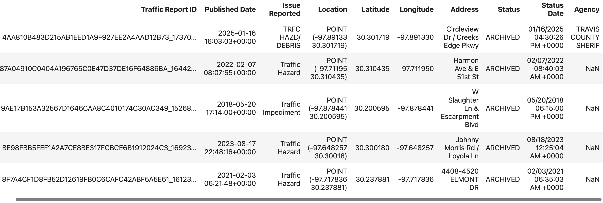

Feature Engineering
=======================

Definition
^^^^^^^^^^^

Feature engineering is the process of **transforming raw data into
meaningful inputs (features)** that machine learning models can
understand.

**Why it matters**

-  The quality of your features often matters **more than the choice of
   algorithm**.

-  A well-chosen feature can reveal hidden patterns, making the model
   smarter and more accurate.

**Analogy**

-  Imagine you are predicting whether a basketball player will score.

   -  Raw data might be: *player’s height, team name, jersey number,
      last game date*.

   -  After feature engineering, useful features might be: *average
      points per game, shooting percentage in the last 5 games, fatigue
      level, opponent’s defense rating*.

-  Same raw data, but better structured information.

Key Types of Feature Engineering
^^^^^^^^^^^^^^^^^^^^^^^^^^^^^^^^^

1. **Cleaning**  Fixing missing values, removing duplicates, converting
   data types.

2. **Transformation** Scaling numbers, normalizing values, encoding
   categorical data.

3. **Creation**  Making new features from old ones.

   -  **Example**: from “Published Date” you can create “Hour of Day,”
      “Day of Week,” “Is Weekend.”

4. **Selection**  Choosing the most important features to avoid noise.

“Feature engineering is how we turn messy real-world data into the smart
signals that help AI make better predictions. It’s less about magic
algorithms and more about asking the right questions of your data.”

We will look at a the dataset from Austin Traffic Data
`dataset <https://raw.githubusercontent.com/joestubbs/coe379l-fa25/refs/heads/main/datasets/unit01/sampled_ATX_Traffic.csv>`
`Source <https://www.designsafe-ci.org/data/browser/tapis/designsafe.storage.community/%2FTraining%2FSampleData>`
and discuss the various Feature Engineering Tasks.

.. code-block:: python3 

  # import the library and create the DataFrame 
  >>> import pandas as pd 
  >>> data = pd.read_csv('sampled_ATX_Traffic.csv')
  >>> data.head()

Feature Engineering Tasks
^^^^^^^^^^^^^^^^^^^^^^^^^^^

1. Datetime Features (from Published Date)

==================== ======================================
Derived Feature      Purpose
==================== ======================================
Incident Hour (0-23) Identify time-of-day patterns
Day of Week (0-6)    Capture weekday/weekend behavior
Weekend Flag         Binary flag (1 = Weekend, 0 = Weekday)
==================== ======================================

2. Categorical Encoding

+-----------------------+-----------------------+-----------------------+
| Feature               | Encoding Method       | Notes                 |
+=======================+=======================+=======================+
| Issue Reported        | One-Hot Encoding or   | High cardinality may  |
|                       | Label Encoding        | require frequency     |
|                       |                       | encoding              |
+-----------------------+-----------------------+-----------------------+
| Agency                | One-Hot Encoding      | Depends on how many   |
|                       |                       | unique agencies there |
|                       |                       | are                   |
+-----------------------+-----------------------+-----------------------+

3. Spatial Features (Latitude/Longitude)

+-----------------------------------+-----------------------------------+
| Transformation                    | Purpose                           |
+===================================+===================================+
| Distance from Downtown (30.2672,  | Proximity to city center          |
| -97.7431)                         |                                   |
+-----------------------------------+-----------------------------------+
| Latitude & Longitude Scaling      | Normalize for distance-based      |
|                                   | models                            |
+-----------------------------------+-----------------------------------+
| Location Clusters (Optional)      | KMeans or DBSCAN clustering on    |
|                                   | coordinates                       |
+-----------------------------------+-----------------------------------+

4. Address Text Feature Engineering (Optional but Valuable)

====================== =======================================
Transformation         Purpose
====================== =======================================
Extract Street Names   e.g., “E 6th St”
Road Type Flag         e.g., Highway, Service Road, Blvd, etc.
Text Length of Address Indirect signal for address granularity
====================== =======================================

5. Feature Scaling

================================== ==============================
Feature                            Scaling Method
================================== ==============================
Latitude, Longitude, Distance      MinMaxScaler (scale to 0-1)
Time-based Features (if numerical) StandardScaler (mean 0, std 1)
================================== ==============================

Target & ML Goals
^^^^^^^^^^^^^^^^^^

+-----------------------+-----------------------+-----------------------+
| Task                  | Target Feature        | ML Type               |
+=======================+=======================+=======================+
| **Classification of   | Issue Reported        | Multiclass            |
| Incident Type**       |                       | Classification        |
+-----------------------+-----------------------+-----------------------+
| **Cluster Incident    | Latitude/Longitude +  | Clustering            |
| Hotspots**            | Time                  | (KMeans/DBSCAN)       |
+-----------------------+-----------------------+-----------------------+
| **Bias Detection by   | Agency vs. Incident   | C                     |
| Agency**              | Types                 | lustering/Exploratory |
|                       |                       | Analysis              |
+-----------------------+-----------------------+-----------------------+

Summary:
^^^^^^^^

* **Traffic incidents are inherently temporal.**  
   Patterns in collisions, hazards, and stalled vehicles **follow time-of-day and day-of-week rhythms**.

* **Machine Learning models don't understand timestamps.**  
   They need **explicit numerical or categorical features** representing patterns (e.g., rush hours, weekends).

* **For Clustering**, time-of-day and day-of-week help reveal "incident patterns" that are **spatial-temporal**:

  * Where and when do collisions spike?

  * Are stalled vehicles more common on weekends?

* **For Classification**, datetime-derived features add valuable predictive signals:

  * If it’s Friday 5 PM, there’s a higher chance it’s a collision.

  * If it’s Sunday afternoon, it might be a hazard or road closure.

