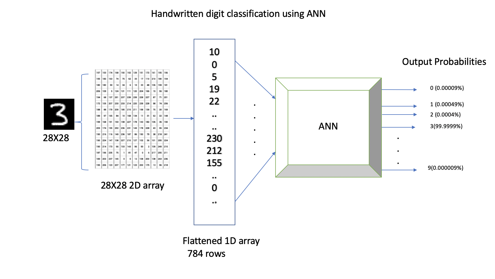
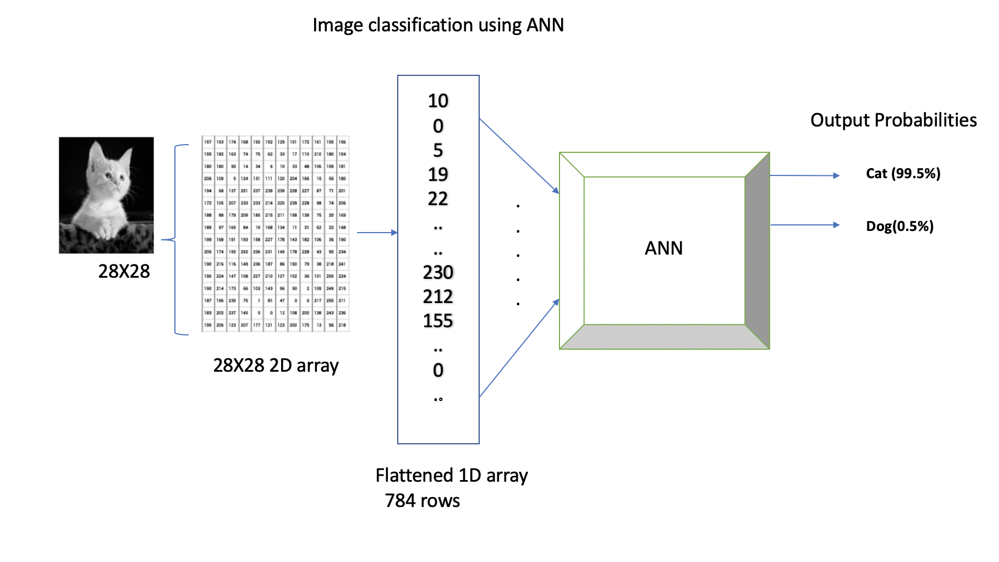
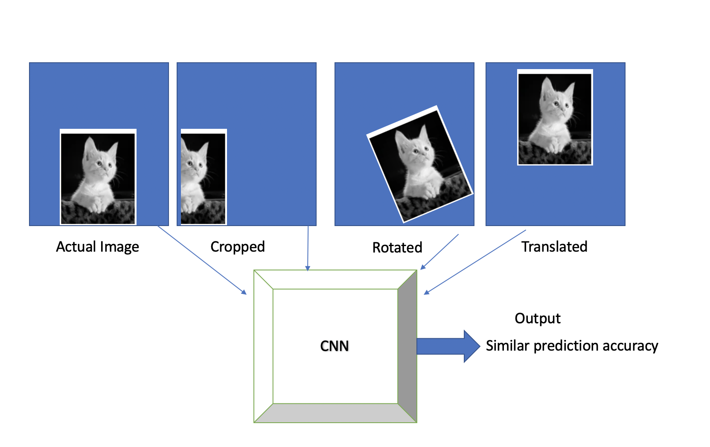
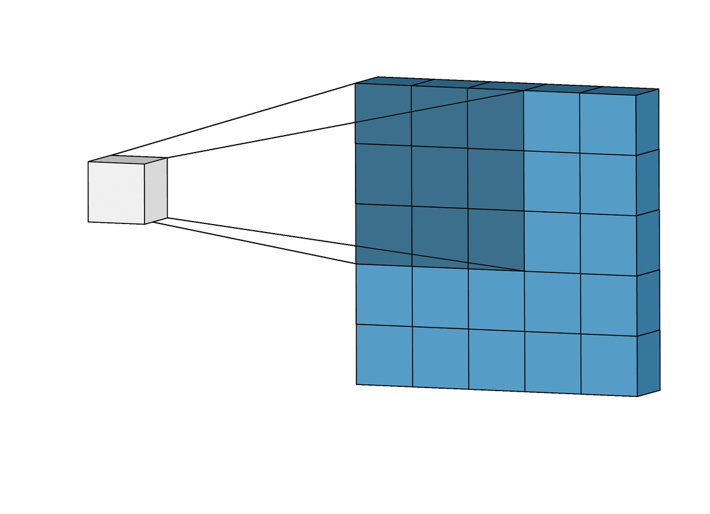
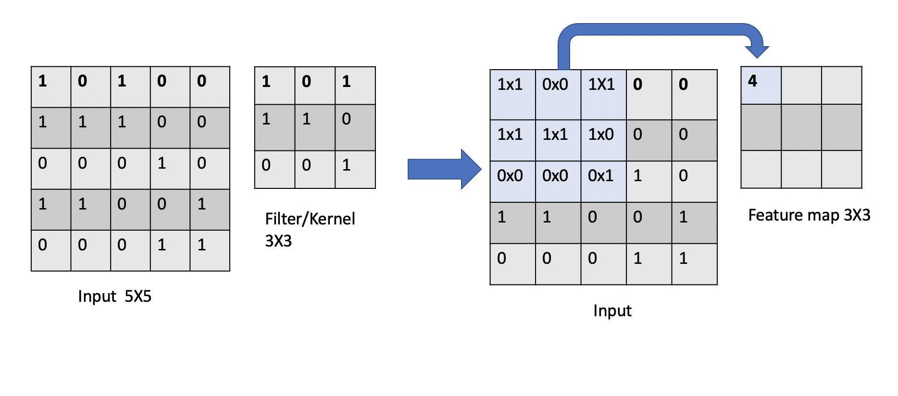
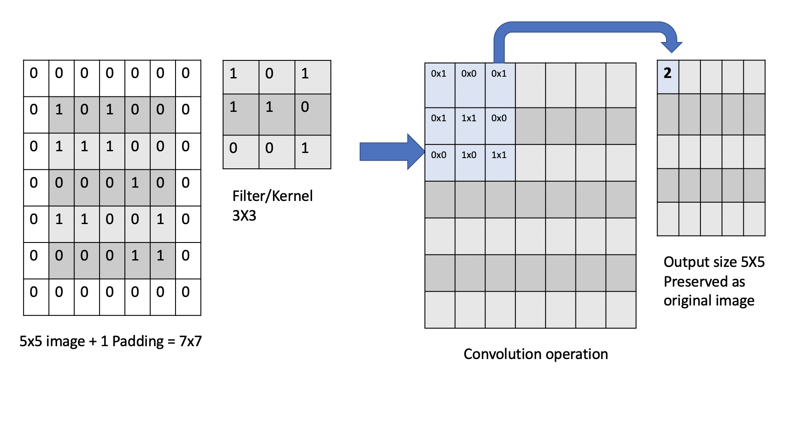
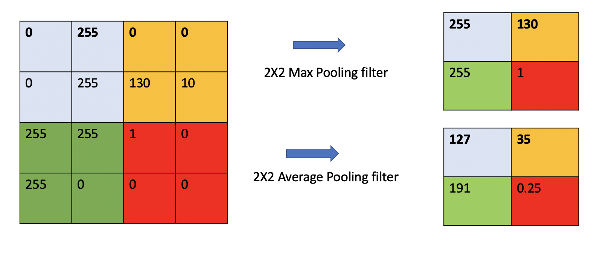
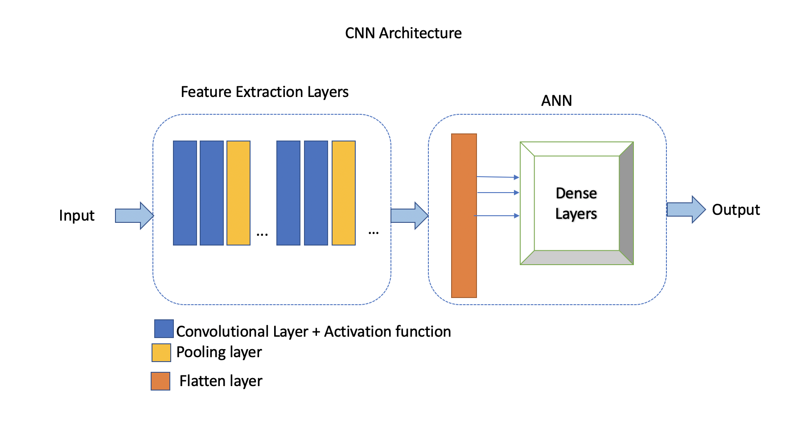
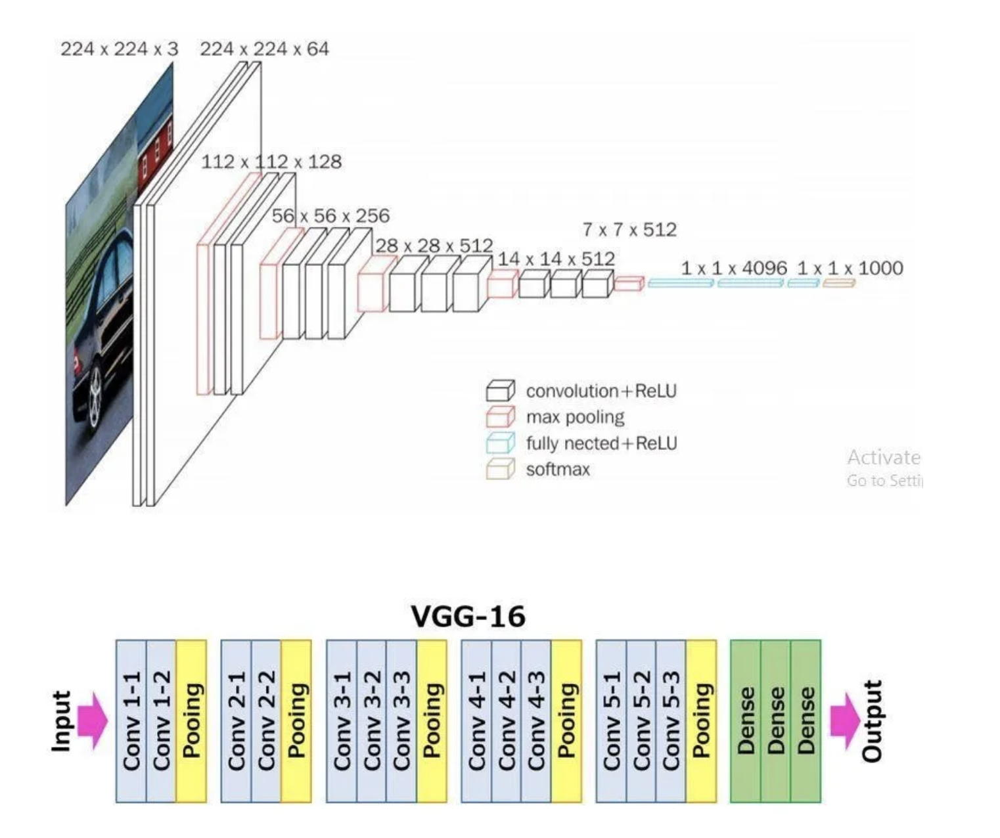

Convolutional Neural Networks (CNNs)
================================================

In this lecture, we will introduce Convolutional neural networks (CNNs) - a class of deep neural networks primarily used in image recognition and computer vision tasks. We will also discuss why CNNs are prefered over ANNs for image classification. 
Although CNNs are a popular choice for image classification, they can also be used in Natural Language processing applications.

By the end of this module, students should be able to:

- Understand challenges associated with ANNs.

- What makes CNN a better choice for solving image classification problems

- Understand different CNN Architectures: For example: VGG16 and LeNet-5 

Challenges with ANN
~~~~~~~~~~~~~~~~~~~~~
In the previous lecture, we saw an example of handwritten digit classification using ANNs.

We were able to achieve high prediction accuracy by an ANN model with multiple hidden layers. 
Let's say we want to build a similar ANN model to distinguish between images of cats and dogs. 
Let's assume that the images will be the same size of 28x28 pixels.

We know that the neural network takes input that has to be a flattened 1D vector. In the example above, 
the input vector provided to the neural network will be of size 784x1.
We can add one or more hidden layers, and our output layer will have two classes, probabilities 
showing whether a given image is a cat or a dog. 

While our neural network model can perform well on certain test data, in general its performance will be hindered 
due to the following limitations with ANNs:

**1. Spatial Information:**
ANNs treat input data as flat vectors, disregarding the spatial relationships present in the image.
As seen in the previous examples, we input a 1D array of pixel intensities to the neural network, 
which is formed by flattening the 2D array of size 28x28 pixels. 
Unfortunately, this approach causes a loss of spatial information associated with the image. 
For example, while detecting the cat's pointy ears, with ANNs we may not know which two or more pixels
placed next to each other formed a pointy edge of the cat's ears, and this could be an important and 
distinguishing feature to differentiate between a cat and a dog.  In contrast, CNNs preserve the spatial 
structure of images through *convolutional* and *pooling* layers, allowing them to capture local patterns and spatial 
hierarchies effectively.

**2. Translation Invariance:** ANNs lack translation invariance, meaning they cannot recognize 
objects if their position in the image changes.
For example, ANNs might excel at predicting cats that are on the left side of an image and then
fail to recognize the cat if the same picture is translated, rotated or cropped. CNNs, on the other hand, 
use a small `filter` also known as a
`kernel`, in the convolutional layer, which is translated across the entire image
to learn the hierarchical features in an image. 

**3. Feature Hierarchies:** ANNs lack the capability of learning hierarchical features.
On the other hand in CNNs, lower layers learn low-level features like edges and textures, while higher 
layers learn more abstract features like shapes and objects. 

**4. High Dimensionality:**
Dealing with the exponentially growing number of trainable parameters is also one of the major challenges with ANNs. 
Even with simpler grayscale images of size 28x28 pixels, the number of trainable parameters can easily exceed 
tens or hundreds of thousands. 
If we were to work with color images of higher resolution, the number of trainable parameters would be to 
the order of millions. 
This means that it could take a significant amount of time to train such models even with powerful 
compute hardware. CNNs, with their convolutional and pooling layer, 
have fewer parameters and are typically computationally less expensive in many cases.

Considering the above challenges we will see how **Convolutional Neural Networks** can address them. 

Convolutional Neural Networks (CNNs)
~~~~~~~~~~~~~~~~~~~~~~~~~~~~~~
Convolutional Neural Networks (CNNs) are specifically designed for processing structured grid data, such as images and videos.
They are capable of identifying the location of an object in an image by performing a mathematical operation known as 
*convolution*. This capability also enables them to handle shifts and translations in the position of objects within 
an image, which makes them an ideal choice for solving computer vision problems such as image classification, 
object detection, face recognition, and autonomous driving, among others.
For instance, CNNs can provide accurate predictions even when presented with translated, rotated, or cropped images of cats.

As we discussed, the key lies in two simple yet powerful layers of a CNN, known as the 
*convolutional* and *pooling* layers.

Convolutional Layer
^^^^^^^^^^^^^^^^^^^^

In CNNs, the convolutional layer is the first layer that is applied to the input data to filter information and
produce a *feature map*. You can think of these filters as a sliding window moving across the image, 
trying to detect features or local patterns in an image.
For example, if we are detecting a human face in the image, filters could detect low-level features such as
horizontal edges, vertical edges, curves, corners, etc. Based on combinations of these low-level features, 
the next set of filters could determine slightly higher-level features, such as eyes, nose, ears, etc. 

    An animation of a convolutional layer (credit: [1]).

In the above animation, you can see how a :math:`3x3` window slides across an image of size :math:`5x5` 
and builds a feature map of size :math:`3x3` using the convolution operation.
Let's understand the convolution operation that is performed when the kernel/filter slides across the 
input image with example below.

**Convolution Calculation: An Example.**
Suppose we have a :math:`5x5` input image and we apply a :math:`3x3` 2D filter to it for feature learning. 
To perform a convolution, we sum up the element-wise dot products of the input and filter. This value is 
added to the output, referred to as a *feature map*.
Then, we move the sliding window by a certain number of cells and repeat the calculation. We continue 
in this way, adding an additional value to the feature map with each calculation. 

The number of cells we slide the window by during each iteration is called the *stride*. 
For example, in the animation above, the stride is 1 because we slide the filter 1 cell during each iteration. 

Once we have collected the values for the feature map, an activation function is applied element-wise to every 
element in the feature map. This final result is then passed on to the next layer. 

**Dimensions of a Feature Map.** 
The dimension of the feature map can be computed mathematically as 

.. math:: 
    dim FM = (n-f+1) \times (n-f+1),

where :math:`n` is the input dimension, and :math:`f` is the filter dimension. 
For example, in the case illustrated above, the output dimension will be of size :math:`(5-3+1) \times (5-3+1)= 3\times 3`.

**Training Convolutional Layers.**
Each filter in a CNN has a set of learnable parameters, which are the weights, just as in the ANN case we 
discussed last lecture. These weights are adjusted 
during the training process through gradient descent with the goal of minimizing the loss function. 

.. note:: 

  A CNN can have more than one convolutional layer. These multiple convolutional layers 
  enable the network to learn increasingly complex and abstract features from the input data
  and allows the network to capture hierarchical representations of the input data. 
.. Lower layers typically learn low-level features such as edges, corners, and textures, while higher layers learn higher-level 
.. features or combinations of lower-level features that represent more abstract concepts, such as object parts or entire objects.

**Translational Invariance in Convolutional Layers.**
Convolutional layers also achieve a degree of `translational invariance` through parameter sharing. That is, 
translations of the input do not impact the output. 
The same set of filter weights is applied across all spatial positions of the input feature maps. 
This makes it invariant to any shifts or translations. For example, if a filter learns to detect a horizontal edge in one region of the image, it can also detect the same in a slightly shifted position.    

Note that, due to the way a convolution operates, the pixels from the corners of the image will be used fewer times in 
the output calculations as compared to pixels in the middle of the image.
This is due to the fact that the sliding window will slide over the middle more times than the edges. 
Thus, we could undervalue information on the edges of images.

To avoid this we use a technique known as *padding*, which adds a layer of zeros on the outer edges of image, 
thereby making the image bigger and preserving the pixels from image corners.

Pooling Layer
^^^^^^^^^^^^^

In CNNs, the pooling layer is applied after the convolutional layers. The purpose of the pooling layer is
to reduce the size (i.e., dimension) of the feature map. Conceptually, the pooling operation "summarizes" 
the features present in the filtering region. 

The pooling layer uses a sliding window with a fixed stride, just like in a convolutional layer.
However, unlike in a convolutional layer, the computation in a pooling layer
is fixed. In other words, the pooling layer contains no learnable parameters (i.e. weights). Instead, 
a pooling layer typically uses either the *max* or *average* function to compute its 
output from its filter window. You can think of pooling as a kind of "downsampling" of the feature maps, 
and the size of the pooling filter selected is usually much smaller than size of feature map.

As we mentioned, the two most popular methods of pooling are:

1. Max Pooling

2. Average Pooling

These are simply the functions used to compute the output for each filter window. 
An example will make things more clear.

Consider the 4x4 feature map pictured on the left above and suppose we want to do pooling 
with a 2x2 filter and a stride of 2. Sliding the 2x2 window over the 4x4 input results in 
4 2x3 windows colored blue, yellow, green and red, as pictured. Then:

* With **Max Pooling**, we "summarize" each window by taking the max value in that region.
  This is pictured in the top right. 

* With **Average Pooling** we "summarize" each window by taking the average of the values in 
  that region. This is pictured in the bottom right. 

.. note:: 

    Max Pooling is typically used when the image has dark background to bring up 
    the brighter pixels.

With the understanding of Convolutional and Pooling Layers we are now ready to put 
it all the building blocks together and construct a CNN model.

Basic CNN Architecture
~~~~~~~~~~~~~~~~~~~~~~

CNNs are primarily made from the building blocks: Convolutional layer, pooling layer, 
flatten and fully connected (or "dense") layers.

The convolutional layers along with the activation function and pooling layers are referred 
to as the *feature extraction* stage. On the other hand, the flatten layer(s) and dense layers (ANN) comprise 
the *prediction stage*. The output of convolutional and pooling layers in CNNs is typically in the form of
a multi-dimensional feature map, where each feature map represents the activation of neurons at different 
spatial locations. 

In a convolutional layer, a filter is applied to the input image and based on the size of filter,
a feature map is created. When creating a convolutional layer we specify the number of filters and it's size.
Adding a convolutional layer is very straightforward with TensorFlow Keras:

.. code-block:: python3

    from tensorflow.keras.layers import Conv2D
    from tensorflow.keras import Sequential
    # Intializing a sequential model
    model = Sequential()
    model.add(Conv2D(64, (3, 3), activation='relu', padding="same", input_shape=(28, 28, 1)))

In ``the model.add()`` code above, we are creating a 2D convolutional layer with 64 filters of size :math:`3x3`.
Let us look at each of the parameters: 

* ``activation='relu'``: This specifies the activation function applied to the output of the convolutional 
  layer; in this case, the ReLU (Rectified Linear Unit), which is a commonly used activation function in CNNs.

* ``padding='same'``: This specifies the type of padding to be applied to the input feature maps before performing 
  the convolution operation. The ``same`` here means that the input is padded with zeros so that the output has the 
  same dimensions as the input. This helps preserve spatial information at the edges of the feature maps.

* ``input_shape=(28, 28, 1)``: This specifies the shape of the input data that will be fed into the model. 
  In this case, the input data is expected to have a shape of (28, 28, 1), indicating that it consists of 
  28x28 grayscale images (i.e., 1 channel). The (28, 28, 1) tuple represents (height, width, channels).

After adding a convolutional layer we add a pooling layer with either the ``MaxPooling2D`` or ``AveragePooling2D``
classes, to do max pooling or average pooling, respectively.

.. code-block:: python3

    from tensorflow.keras.layers import MaxPooling2D
    model.add(MaxPooling2D((2, 2), padding = 'same'))

We can keep adding a series of convolutional and pooling layers before flattening the output and
finishing with a set of fully connected layers to produce the final output. Why
do we need a flatten layer? 

The Flatten layer in a Convolutional Neural Network (CNN) is necessary to transition from the spatially 
structured representation of the data obtained from the convolutional and pooling layers to a format 
suitable for fully connected layers, which are typically used for making predictions or classifications.

.. code-block:: python3

    # Series of alternating convolutional and pooling layers
    model.add(Conv2D(32, (3, 3), activation='relu', padding="same"))
    model.add(MaxPooling2D((2, 2), padding = 'same'))
    model.add(Conv2D(32, (3, 3), activation='relu', padding="same"))
    model.add(MaxPooling2D((2, 2), padding = 'same'))

.. code-block:: python3

    from tensorflow.keras.layers import Flatten, Dense

    # flattening the output of the conv layer after max pooling to make it ready for creating dense connections
    model.add(Flatten())

    # Adding a fully connected dense layer with 100 neurons
    model.add(Dense(100, activation='relu'))

    # Adding the output layer with num_classes and activation functions as softmax for class classification problem
    num_classes = 3
    model.add(Dense(num_classes, activation='softmax'))

As a reminder, the formula for calculating the total number of trainable parameters in each layer 
is :math:`(Filter\_Size * Filter\_Size * Size\_of\_input\_channel +1 ) * number\_of\_filters`

Solving the Fashion MNIST classification example with CNNs
~~~~~~~~~~~~~~~~~~~~~~~~~~~~~~~~~~~~~~~~~~~~~~~~~~~~~~~~~~~~~~~~~~~~~~~~~~~~~~~~

Let's solve the classification problem on the MNIST fashion dataset using CNNs. 
Note that, in the image processing step (Step 2),  we don't flatten the image, since CNNs are 
able to use 2D shapes. Thus, the call to ``reshape`` on the ``X_train`` and ``X_test`` objects should 
be removed, but we will still normalize them. 
Step 3 remains same, but we will update Step 4 to implement a CNN model instead of an ANN.  

Step1: Load the data

.. code-block:: python3

    # Loading the data
    from tensorflow.keras.datasets import fashion_mnist
    (X_train, y_train), (X_test, y_test) = fashion_mnist.load_data()

Step2: Normalize the data

.. code-block:: python3

    X_train_normalized = X_train / 255.0
    X_test_normalized = X_test / 255.0

Step 3: Convert y to categorical using one hot encoding

.. code-block:: python3

    from tensorflow.keras.utils import to_categorical

    # Convert to "one-hot" vectors using the to_categorical function
    num_classes = 10
    y_train_cat = to_categorical(y_train, num_classes)
    y_test_cat = to_categorical(y_test, num_classes)

Step 4: Build the CNN model

.. code-block:: python3

    # Importing all the different layers and optimizers
    from tensorflow.keras.layers import Dense, Dropout, Flatten, Conv2D, MaxPooling2D
    from tensorflow.keras.optimizers import Adam

    # Intializing a sequential model
    model_cnn = Sequential()

    # Adding first conv layer with 64 filters and kernel size 3x3 , padding 'same' provides the output size same as the input size
    # Input_shape denotes input image dimension of MNIST images
    model_cnn.add(Conv2D(64, (3, 3), activation='relu', padding="same", input_shape=(28, 28, 1)))
    # Adding max pooling to reduce the size of output of first conv layer
    model_cnn.add(MaxPooling2D((2, 2), padding = 'same'))

    model_cnn.add(Conv2D(32, (3, 3), activation='relu', padding="same"))
    model_cnn.add(MaxPooling2D((2, 2), padding = 'same'))

    model_cnn.add(Conv2D(32, (3, 3), activation='relu', padding="same"))
    model_cnn.add(MaxPooling2D((2, 2), padding = 'same'))

    # flattening the output of the conv layer after max pooling to make it ready for creating dense connections
    model_cnn.add(Flatten())

    # Adding a fully connected dense layer with 100 neurons
    model_cnn.add(Dense(100, activation='relu'))

    # Adding the output layer with 10 neurons and activation functions as softmax since this is a multi-class classification problem
    model_cnn.add(Dense(10, activation='softmax'))

Step 5: Let's compile and fit it.

.. code-block:: python3

    model_cnn.compile(optimizer='adam', loss='categorical_crossentropy', metrics=['accuracy'])
    model_cnn.summary()
    model_cnn.fit(X_train_normalized, y_train_cat, validation_split=0.2, epochs=5, batch_size=128, verbose=2)

Step 6: Evaluate on the test set.

.. code-block:: python3 

    # evaluate on test 
    test_loss, test_accuracy = model.evaluate(X_test_normalized, y_test_cat, verbose=0)

What did you notice about the difference between number of trainable parameters in a CNN vs the ANNs we 
looked at in the previous lecture? What about the accuracy?

CNN Architectures
~~~~~~~~~~~~~~~~~
Different CNN architectures have emerged in the past, some of the popular ones are:

- LeNet-5
- VGG16
- GoogleNet
- AlexNet

Each has specific use cases where they can be used. More on the architectural details
is given in [2]. In this lecture, we will cover some basics of VGG16 and LeNet-5.

VGG16
~~~~~

The VGGNet architecture was proposed by Karen Simonyan and Andrew Zisserman, from the Visual 
Geometry Group (VGG) at the University of Oxford, in 2014 [3]. 
It finished first runner-up in the ImageNet annual competition (ILSVRC) in 2014.

VGGNet has two variants: VGG16 and VGG19. 
Here, 16 and 19 refer to the total number of convolution and fully connected layers present in each 
variant of the architecture.

VGGNet stood out for its simplicity and the standard, repeatable nature of its blocks. 
Its main innovation over standard CNNs was simply its increased depth (number of layers). Otherwise, it 
utilized the same building blocks --- convolution and pooling layers --- for feature extraction. 

If you are interested, consider reading the `paper <https://arxiv.org/pdf/1409.1556v6.pdf>`_.

VGG16 Architecture Explained
^^^^^^^^^^^^^^^^^^^^^^^^^^^^

1. **Input Layer**: The input to VGG16 is a color image of 
224x224 pixels. 

2. **Convolutional Layers**: It contains 13 convolutional layers, each with an ReLU activation function,
and it contains 5 MaxPooling layers, interspersed within the convolutional layers, as depicted above. 
The convolution layers use small 3x3 kernels, with stride of 1 pixel.
The number of filters in each convolutional layer increases as we go deeper into the network, 
from 64 filters in the first few layers to 512 filters in the later layers.

3. **MaxPooling Layers**: After each convolutional
block we have a MaxPooling layer with a 2x2 window and a stride of 2. 
Max-pooling is used to reduce the spatial dimensions of the feature maps while retaining the most important features.

4. **Fully Connected Layer**: After the last convolutional block, VGG16 has 3 fully connected dense layers, followed by softmax for classification.
The first two fully connected layers have 4096 neurons each, followed by a third fully connected layer with 1000 neurons, which is the number of classes in the ImageNet dataset for which VGG16 was originally designed.

VGG16 is available from the ``keras.applications`` package and can be imported using the following code:

.. code-block:: python3

    from keras.applications.vgg16 import VGG16

A VGG16 model can be created with a single line code and loaded with "pre-trained" weights. 
In this case, we pull the weights learned from training on the ImageNet dataset. 

.. code-block:: python3

    model_vgg16 = VGG16(weights='imagenet')

To check the number of trainable parameters look at the summary of model

.. code-block:: python3

    model_vgg16.summary()

    Model: "vgg16"
    _________________________________________________________________
    Layer (type)                Output Shape              Param #   
    =================================================================
    input_1 (InputLayer)        [(None, 224, 224, 3)]     0         
                                                                    
    block1_conv1 (Conv2D)       (None, 224, 224, 64)      1792      
                                                                    
    block1_conv2 (Conv2D)       (None, 224, 224, 64)      36928     
                                                                    
    block1_pool (MaxPooling2D)  (None, 112, 112, 64)      0         
                                                                    
    block2_conv1 (Conv2D)       (None, 112, 112, 128)     73856     
                                                                    
    block2_conv2 (Conv2D)       (None, 112, 112, 128)     147584    
                                                                    
    block2_pool (MaxPooling2D)  (None, 56, 56, 128)       0         
                                                                    
    block3_conv1 (Conv2D)       (None, 56, 56, 256)       295168    
                                                                    
    block3_conv2 (Conv2D)       (None, 56, 56, 256)       590080    
                                                                    
    block3_conv3 (Conv2D)       (None, 56, 56, 256)       590080    
                                                                    
    block3_pool (MaxPooling2D)  (None, 28, 28, 256)       0         
                                                                    
    block4_conv1 (Conv2D)       (None, 28, 28, 512)       1180160   
                                                                    
    block4_conv2 (Conv2D)       (None, 28, 28, 512)       2359808   
                                                                    
    block4_conv3 (Conv2D)       (None, 28, 28, 512)       2359808   
                                                                    
    block4_pool (MaxPooling2D)  (None, 14, 14, 512)       0         
                                                                    
    block5_conv1 (Conv2D)       (None, 14, 14, 512)       2359808   
                                                                    
    block5_conv2 (Conv2D)       (None, 14, 14, 512)       2359808   
                                                                    
    block5_conv3 (Conv2D)       (None, 14, 14, 512)       2359808   
                                                                    
    block5_pool (MaxPooling2D)  (None, 7, 7, 512)         0         
                                                                    
    flatten (Flatten)           (None, 25088)             0         
                                                                    
    fc1 (Dense)                 (None, 4096)              102764544 
                                                                    
    fc2 (Dense)                 (None, 4096)              16781312  
                                                                    
    predictions (Dense)         (None, 1000)              4097000   
                                                                    
    =================================================================
    Total params: 138357544 (527.79 MB)
    Trainable params: 138357544 (527.79 MB)
    Non-trainable params: 0 (0.00 Byte)

LeNet-5
~~~~~~~~~
LeNet-5 is one of the earliest pre-trained models proposed by Yann LeCun and others. It was originally trained 
for the hand written digit classification task on the MNIST dataset which we saw earlier. 
LeNet-5 was designed to be 
computationally efficient, making it suitable for training on relatively small datasets and deploying 
on resource-constrained devices. The architecture is relatively simple compared to more modern deep 
learning architectures, which makes it easy to understand, implement, and debug.

It cannot be directly imported from Keras, but we can easily implement it using a Sequential model
as follows:

.. code-block:: python

    model = Sequential()
    
    # Layer 1: Convolutional layer with 6 filters of size 5x5, followed by average pooling
    model.add(Conv2D(6, kernel_size=(5, 5), activation='relu', input_shape=input_shape))
    model.add(AveragePooling2D(pool_size=(2, 2)))
    
    # Layer 2: Convolutional layer with 16 filters of size 5x5, followed by average pooling
    model.add(Conv2D(16, kernel_size=(5, 5), activation='relu'))
    model.add(AveragePooling2D(pool_size=(2, 2)))
    
    # Flatten the feature maps to feed into fully connected layers
    model.add(Flatten())
    
    # Layer 3: Fully connected layer with 120 neurons
    model.add(Dense(120, activation='relu'))
    
    # Layer 4: Fully connected layer with 84 neurons
    model.add(Dense(84, activation='relu'))
    
    # Output layer: Fully connected layer with num_classes neurons (e.g., 10 for MNIST)
    model.add(Dense(num_classes, activation='softmax'))
    

Summary
~~~~~~~

VGG16 Vs LeNet-5, which architecture to choose from?

* Complexity: VGG16 is a deep convolutional neural network with 16 layers (including convolutional and pooling layers) 
  and a large number of parameters. It is more suitable for complex image classification tasks with large datasets.
  
  LeNet-5 is a shallow convolutional neural network with only 5 layers, making it less complex compared to VGG16. 
  It is suitable for simpler image classification tasks with smaller datasets.

* Pretraining: VGG16 has been pretrained on the ImageNet dataset which we will talk about more in a later lecture, 
  but ImageNet contains millions of images across thousands of categories. If your task contains image that are 
  similar to ImageNet, using VGG16 as a feature extractor or fine-tuning it on your dataset can yield good results.

  LeNet-5 was originally designed for handwritten digit recognition on the MNIST dataset. If your task is similar to  
  MNIST (e.g., digit recognition, simple pattern recognition), LeNet-5 can be a good choice.

* Image Size: VGG16 expects input images to have a minimum size of 32x32 pixels. It performs better with 
  larger images, typically 224x224 pixels, due to its deeper architecture and larger receptive fields. 

  LeNet-5 is designed for small grayscale images of size 28x28 pixels. It is less suitable for larger or more 
  complex images due to its limited capacity and smaller receptive fields.

* Computational Resources: Training VGG16 from scratch or fine-tuning it on large datasets requires significant 
  computational resources (GPU, memory, and time).
  
  Training LeNet-5 is computationally less demanding compared to VGG16, making it suitable for environments 
  with limited computational resources.

References and Additional Resources
~~~~~~~~~~~~~~~~~~~~~~~~~~~~~~~~~~~

1. `Convolution Animation <https://towardsdatascience.com/intuitively-understanding-convolutions-for-deep-learning-1f6f42faee1>`_ 
2. `Types of CNN Architectures <https://towardsdatascience.com/various-types-of-convolutional-neural-network-8b00c9a08a1b>`_ 

