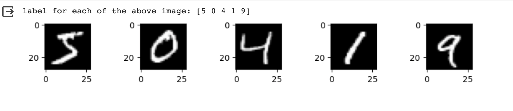
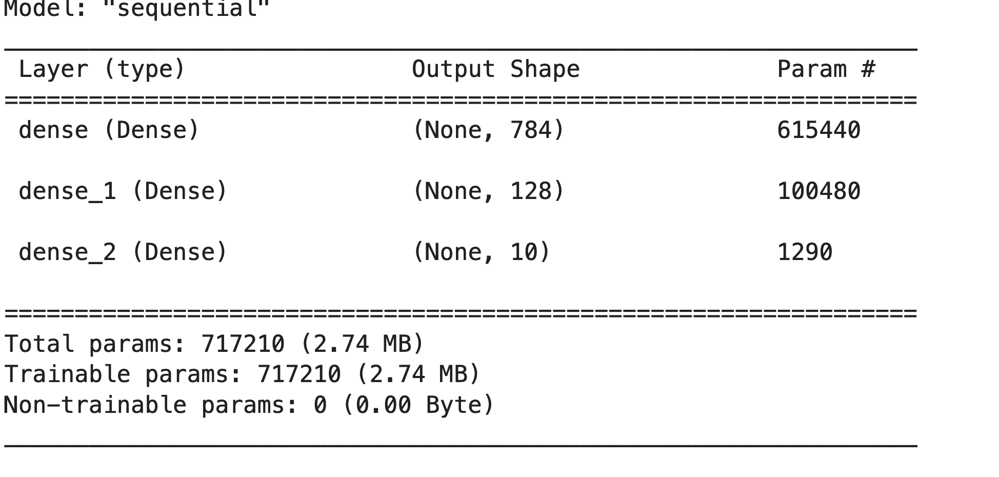
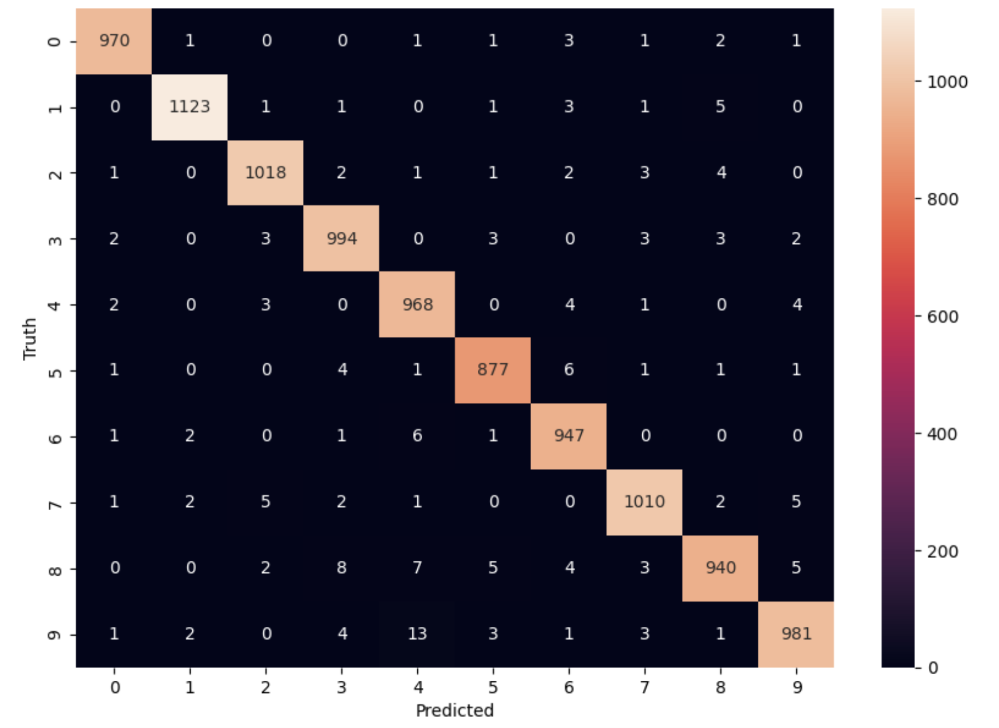

Hands-on Neural Networks 
============================

In this section we will build a simple neural network, train it and validate it on a sample test data. For this excercise we will use a popular dataset from Keras,
known as the **MNIST** (Modified National Institute of Standards and Technology) dataset. This dataset is collection of around 70,000 images of size 28X28 pixels of handwritten digits from 0 to 9 and our goal is to accurately identify the digits by creating a Neural Network.

By the end of this module students should be able to:

1. Import the Keras MNIST dataset.
2. Pre-process images so they are suitable to be fed to the neural network.
3. Apply data preprocessing for converting output labels to one-hot encoded variables.
4. Build a sequential model neural network.
5. Evaluate the model's performance on test data.
6. Add more layers to the neural network and evaluate if the model's performance improved or degraded, 
   leveraging the same test data.

Step 1: Importing required libraries and data
~~~~~~~~~~~~~~~~~~~~~~~~~~~~~~~~~~~~~~~~~~~~~~

We know that the **mnist** dataset is available in ``keras`` so we will first import keras and then import the dataset.
MNIST has a training dataset of 60,000, 28x28 grayscale images of handwritten digits 0-9, along with a test data of 10,000 grayscale images of size 28x28 pixels (0-9 digits).

.. code-block:: python3

    import keras
    from keras.datasets import mnist

We will load the training and test data directly, as below

.. code-block:: python3

    (X_train, y_train), (X_test, y_test) = mnist.load_data()

This returns a tuple of numpy arrays:  ``(X_train, y_train)``, ``(X_test, y_test)``.
We can inspect the shape:

.. code-block:: python3

    # Shape of training data. X_train contains train images and y_train contains output labels for train images
    print(X_train.shape)
    print(y_train.shape)

    # Shape of test data. X_test contains test images and y_test contains output labels for test images 
    print(X_test.shape)
    print(y_test.shape)

Observe that:

* ``X_train`` is 2-D array of 60,000 images of size 28 x 28 pixels.
* ``y_train`` is a 1D array with 60,000 labels.

Step 2: Image Pre-processing
~~~~~~~~~~~~~~~~~~~~~~~~~~~~

A ``grayscale`` image is an image where each pixel is represented by a single scalar value 
indicating the brightness or intensity of that pixel.

Color images have three channels (e.g., red, green, and blue) whereas grayscale images have only one channel.
In a grayscale image, the intensity value of each pixel typically ranges from 0 to 255, where ``0`` 
represents black (no intensity) and ``255`` represents white (maximum intensity). 

Grayscale images are commonly used in various image processing and computer vision tasks, including 
image analysis, feature extraction, and machine learning. 
They are simpler to work with as compared to color images, as they have only one channel, 
making them computationally less expensive to process. 
Additionally, for certain applications where color information is not necessary, grayscale images 
can provide sufficient information for analysis.

Lets look at few sample images from the dataset along with their labels.

.. code-block:: python3

    import matplotlib.pyplot as plt
    plt.figure(figsize=(10, 1))
    for i in range(5):
        # Set the (i+1)st subplot in a plot with 5 images in 1 row. 
        plt.subplot(1, 5, i+1)
        plt.imshow(X_train[i], cmap="gray")
    print('label for each of the above image: %s' % (y_train[0:5]))

The first parameter of ``subplot`` represents the number of rows, the second represents the number of 
columns and the third represents the subplot index. Subplot indices start from 1, so ``i+1`` ensures 
that the subplot position starts from 1 and increases by 1 in each iteration.

Each image has a total of :math:`28 * 28=784` pixels representing intensities between 0-255. Each of these pixel values 
is treated as an independent feature of the images. So the total number of input dimensions/features of the 
images is equal to 784. But the image provided to us is 2D array of size 28x28. We will have to reshape/flatten it
to generate a 1D vector of size 784 so it can be fed to the very first dense layer of the neural network.
We will use the ``reshape`` method to transform the array to desired dimension.

.. code-block:: python3

    # Flatten the images
    image_vector_size = 28*28
    X_train = X_train.reshape(X_train.shape[0], image_vector_size)
    X_test = X_test.reshape(X_test.shape[0], image_vector_size)

``reshape`` is a numpy array method that changes the shape of the given array without changing the
data. By reshaping ``X_train`` with the specified shape (i.e., ``image_vector_size``), 
each image in the training dataset is flattened into a one-dimensional array of size ``image_vector_size``.

Next, we normalize the image pixels, which is a common preprocessing step in machine learning tasks, 
particularly in computer vision, where it helps improve the convergence of models during training. 
Normalization typically involves scaling the pixel values to be within a specific range, such as [0, 1] 

You can either use the Keras preprocessing API to rescale or simply divide the number of pixels by 255.
For this example, we are adopting the later approach

.. code-block:: python3

    X_train_normalized = X_train / 255.0    
    X_test_normalized = X_test / 255.0

Step 3: Data pre-processing on output column.
~~~~~~~~~~~~~~~~~~~~~~~~~~~~~~~~~~~~~~~~~~~~~~

We see that the dependent or target variable (``y_train``) that we want to predict is a 
categorical variable and holds labels 0 to 9. We have previously seen that we can one-hot encode
categorical variables. Here we use utility function from ``keras.util`` to convert to 
one-hot encoding using the ``to_categorical`` method.

.. code-block:: python3

    from tensorflow.keras.utils import to_categorical

    # Convert to "one-hot" vectors using the to_categorical function
    num_classes = 10
    y_train_cat = to_categorical(y_train, num_classes)

Question: Can you guess what ``y_train_cat[0]`` will be? How about ``y_train_cat[1]``?

Step 4: Building a Sequential Neural Network 
~~~~~~~~~~~~~~~~~~~~~~~~~~~~~~~~~~~~~~~~~~~~

Let's now create a neural network. We will create a neural network with one input layer, one 
hidden layer and one output layer and check its prediction accuracy on the test data.

We will need to import Sequential and Dense from Keras.

.. code-block:: python3

    # Importing libraries needed for creating neural network,
    from tensorflow.keras import Sequential
    from tensorflow.keras.layers import Dense

    image_size=28*28

    # create model
    model = Sequential()  
    # input layer
    model.add(Dense(784, activation='relu',input_shape=(image_size,))) 

    # Hidden layer
    model.add(Dense(128, activation='relu')) 

    # Softmax activation function is selected for multiclass classification
    model.add(Dense(10, activation='softmax')) 

There are a few key points in the above architecture. 
First, we have an input layer with 784 perceptrons, the ``input_shape`` equal to the flattened (i.e., 1-dimensional) 
array of the image size, and the ``relu`` activation function. It is very 
common to see the input layer specified in this way, with the number of perceptrons equal to the 
input dimension. But note that this is not strictly required -- we could have used any number of 
perceptrons; the only requirement is tha the input dimension equal the dimension of our inputs (images, 
in our case). 

In the hidden layer, we specified 128 perceptrons. This is not an uncommon choice, but again, we could
have chosen any number here. The only requirement is that the input dimension of each perceptron 
equal the output dimension of the previous layer. But we are not specifying the input dimension, as 
Keras will determine that automatically for us. 

Note also that in both the input and hidden layer, we are using the ``relu`` activation function. Again, 
this is a common choice, but other options could have been chosen. 

Finally, notice that we use the ``softmax`` activation function in the output layer.
The softmax activation function is commonly used in the output layer of a neural network, 
especially in multiclass classification problems. 
It normalizes the output of a neural network into a probability distribution over multiple classes, 
ensuring that the sum of the probabilities of all classes is equal to 1.

Neural Network Architectures
^^^^^^^^^^^^^^^^^^^^^^^^^^^^
We have a lot of options when designing an ANN. How many layers should we use? How many 
perceptrons should each layer have? In general, these are complicated questions and 
there are no simple "recipes" for determining the optimal values. 

However, there are some general guidelines when can use to approach these questions. These 
include answering the following questions:

1. How complicated and/or sophisticated is the underlying pattern that the model is trying to learn?
2. How many computational resources are available to the project? 
3. How much data is available for training? 
4. How important is the accuracy of the final model? 

This is where engineering design and tradeoffs come into play. More complicated patterns 
typically require larger neural networks to achieve higher accuracy. For example, our 
task above of classifying an image as 1 of 10 digits is a much simpler task than trying to 
classify all characters in the Roman alphabet, and that, in turn, is a much simpler task than 
classifying all characters in Kanji. 
Similarly, trying to classify an image as a cat or a dog is much simpler than trying to classigy
any species on the planet. 

Along the same lines, training a larger neural network requires additional computational
resources and more high-quality data than a smaller one. 

Finally, for some problems, accuracy is less critical than others. Imagine a recommendation 
system that predicts music that a listener will enjoy. It may be less critical that this system 
achieve a high accuracy as compared to the OCR system used to load non-digitized data into 
the music catalog. Typically, organizations have a finite set of resources and must be careful 
in how they choose to spend them. 

Model Training
^^^^^^^^^^^^^^

Let's compile and fit the model.

.. code-block:: python3

    model.compile(optimizer='adam', loss='categorical_crossentropy', metrics=['accuracy'])
    model.fit(X_train_normalized, y_train_cat, validation_split=0.2, epochs=5, batch_size=128, verbose=2)

Here we use the following parameters to the ``compile`` method: 

* ``optimizer=adam``: As mentioned previously, this is a good default choice.   
* ``loss=categorical_crossentropy``: As mentioned previously, this is an appropriate choice for categorical 
  problems. 
* ``metrics=["accuracy"]``: Here, we specify accuracy as the metric to track. 

And these to the ``fit`` method: 

* ``validation_split=0.2``: specifies the fraction of the training data to use for validation. In this 
  case, 20% of the training data will be used for validation during training, and the remaining 80% 
  will be used for actual training.
* ``epochs=5``: The number of epochs (iterations over the entire training dataset) to train the model. 
  In this case, the model will be trained for 5 epochs.

.. code-block:: python3

    Epoch 1/5
    375/375 - 3s - loss: 0.0598 - accuracy: 0.9095 - val_loss: 0.0272 - val_accuracy: 0.9594 - 3s/epoch - 8ms/step
    Epoch 2/5
    375/375 - 2s - loss: 0.0202 - accuracy: 0.9693 - val_loss: 0.0188 - val_accuracy: 0.9708 - 2s/epoch - 5ms/step
    Epoch 3/5
    375/375 - 2s - loss: 0.0129 - accuracy: 0.9816 - val_loss: 0.0150 - val_accuracy: 0.9766 - 2s/epoch - 5ms/step
    Epoch 4/5
    375/375 - 2s - loss: 0.0089 - accuracy: 0.9879 - val_loss: 0.0149 - val_accuracy: 0.9763 - 2s/epoch - 5ms/step
    Epoch 5/5
    375/375 - 2s - loss: 0.0061 - accuracy: 0.9921 - val_loss: 0.0154 - val_accuracy: 0.9776 - 2s/epoch - 5ms/step

Let's break down the output: 

* ``375/375``: Indicates that the training process has completed 375 batches out of a total of 375 batches. 
  This suggests that the entire training dataset has been processed in 375 batches during the training process.

* ``Time in seconds`` indicates that the training process took approximately 2/3 seconds to complete that epoch.

* ``loss`` indicates the value of the loss function (typically categorical cross-entropy loss for 
  classification tasks) computed on the training dataset. 

* ``accuracy`` Represents the accuracy of the model on the training dataset. The accuracy value of 
  approximately 0.99 indicates that the model correctly predicted 98% of the training samples.

* ``val_loss`` Represents the value of the loss function computed on the validation dataset. 

* ``val_accuracy`` Represents the accuracy of the model on the validation dataset. The validation 
  accuracy value of approximately 0.98.

* ``5ms/step``  This indicates the average time taken per training step (one forward and backward pass 
  through a single batch) during training.

We can next print the model summary. It shows how many trainable parameters are in the Model

.. code-block:: python3

    model.summary()

Here the total parameters and number of trainable parameters is same which is 717,210.
It is calculated as follows: Total weights from previous layer + Total bias for each neuron in 
current layer, or, :math:`784*784 + 784 = 615,440`.

**Optional:**
In order to see the bias and weights at each epoch we can use the helper function below:

.. code-block:: python3

    from tensorflow.keras.callbacks import LambdaCallback
     # Define a callback function to print weights and biases at the end of each epoch
    def print_weights_and_biases(epoch, logs):
        if epoch % 1 == 0:  
            print(f"\nWeights and Biases at the end of Epoch {epoch}:")
            for layer in model.layers:
                print(f"Layer: {layer.name}")
                weights, biases = layer.get_weights()
                print(f"Weights:\n{weights}")
                print(f"Biases:\n{biases}")

    # Create a LambdaCallback to call the print_weights_and_biases function
    print_weights_callback = LambdaCallback(on_epoch_end=print_weights_and_biases)

When we fit the model, we will specify the ``callback parameter``

.. code-block:: python3

    model.fit(X_train_normalized, y_train_cat, validation_split=0.2, epochs=5, batch_size=128, verbose=2,callbacks=[print_weights_callback])

This will print all the weights and biases in each epoch. 

Once we fit the model, next important step is predicting on the test data.

.. warning:: 

    Be careful with using computational resources on the VM. It is easy to build 
    large networks that exhaust all of the resources and/or to write training 
    loops that take a long time (hour or even days) to complete. 

    Plan your development and training work for the projects carefully! 

    

Step 5: Evaluate the Model's Performance on Test
~~~~~~~~~~~~~~~~~~~~~~~~~~~~~~~~~~~~~~~~~~~~~~~~

We can use the ``model.predict()`` method directly on the entire test dataset. Remember that 
we want to use the normalized data: 

.. code-block:: python3
    
    >>> y_pred = model.predict(X_test_normalized)

We can see the predictions by printing the ``y_pred`` values. For example: 

.. code-block:: python3

    >>> y_pred[0]

    array([7.8945732e-11, 1.6350994e-10, 4.3761141e-09, 2.2113424e-08,
           3.7417313e-17, 1.5567046e-12, 5.6684709e-17, 9.9999994e-01,
           1.9483424e-11, 1.0344545e-08], dtype=float32)

As you can see, the output values are probabilities. How many probability values do we 
expect there to be? And how should we use these to predict the class label? 

Remember the notion of *decision functions* that we have discussed throughout Unit 2 and 3. 
Decision functions provide values that determine whether an instance is in a particular class. 
Thus, there is one decision function, and hence, one value, for each class label. 
In this case, since we used ``softmax`` as the output activation function, the value corresponds 
to the probability that the instance is in that particular class. Therefore, we will get the output class 
from these probablities by getting the maximum value:

.. code-block:: python3

    import numpy as np
    y_pred_final=[]
    for i in y_pred:
        # return the index with the highest probability 
        y_pred_final.append(np.argmax(i))

Visualizing Accuracy with the Confusion Matrix
^^^^^^^^^^^^^^^^^^^^^^^^^^^^^^^^^^^^^^^^^^^^^^^
With a confusion matrix we can see how many correct vs incorrect predictions were made using
the model above.

.. code-block:: python3

    from sklearn.metrics import confusion_matrix
    import seaborn as sns

    cm=confusion_matrix(y_test,y_pred_final)

    plt.figure(figsize=(10,7))
    sns.heatmap(cm,annot=True,fmt='d')
    plt.xlabel('Predicted')
    plt.ylabel('Truth')
    plt.show()

Output of the above confusion matrix is as follows

The numbers highlighted accross the diagonals are correct predictions. While the numbers in
black squares are number of incorrect predictions.

Let's also print the accuracy of this model using code below

.. code-block:: python3

    from sklearn.metrics import classification_report
    print(classification_report(y_test,y_pred_final))

As you can see the accuracy of the above model is 98%. 98% of the times this model predicted
with correct label on the test data.

..
    Let's now see if we can improve the model's training by adding more layers in the neural network.

    ``Can we improve this model by increasing the training parameters? Let's find out.``

    Step 6: Adding one or more hidden layers to the above neural network
    ~~~~~~~~~~~~~~~~~~~~~~~~~~~~~~~~~~~~~~~~~~~~~~~~~~~~~~~~~~~~~~~~~~~~~

    .. code-block:: python3

        from tensorflow.keras import Sequential
        from tensorflow.keras.layers import Dense

        image_size=28*28

        # create model
        model2 = Sequential()  

        model2.add(Dense(256, activation='relu',input_shape=(image_size,))) ###Multiple Dense units with Relu activation
        model2.add(Dense(64, activation='relu'))
        model2.add(Dense(64, activation='relu'))
        model2.add(Dense(32, activation='relu'))

        model2.add(Dense(num_classes, activation='softmax'))
        model2.compile(optimizer='adam', loss='binary_crossentropy', metrics=['accuracy'])
        model2.fit(X_train, y_train_cat, validation_split=0.2, epochs=5, batch_size=128, verbose=2,callbacks=None)
        model2.summary()

    Total params: 223978 (874.91 KB)
    Trainable params: 223978 (874.91 KB)
    Non-trainable params: 0 (0.00 Byte)

    ``From the model summary can you tell how many trainable parameters are present at each layer?``

    Let's look at our model predictions.

    .. code-block:: python3
    
        import numpy as np
        # predicting the model on test data
        y_pred=model2.predict(X_test)

        # As our outputs are probabilities so we will try to get the output class from these probablities by getting the maximum value
        y_pred_final=[]
        for i in y_pred:
            y_pred_final.append(np.argmax(i))

    Next with the help of confusion matrix we can see how many correct vs incorrect predictions were made using the model above.

    .. code-block:: python3

        from sklearn.metrics import confusion_matrix
        import seaborn as sns

        cm=confusion_matrix(y_test,y_pred_final)

        plt.figure(figsize=(10,7))
        sns.heatmap(cm,annot=True,fmt='d')
        plt.xlabel('Predicted')
        plt.ylabel('Truth')
        plt.show()

    .. code-block:: python3

        from sklearn.metrics import classification_report
        print(classification_report(y_test,y_pred_final))

    ``output``
        accuracy                           0.95     10000

    We certainly see an improvement in prediction accuracy. From the confusion matrix we can 
    conclude that the new model has improved on recognizing many digits.

    This concludes all the steps for building a 95% accurate neural network for identifying hand-written digits
    between 0-9.

**In-Class/Take Home Exercise.**
Let's now repeat the hands-on part for MNIST Fashion dataset. MNIST Fashion dataset has 10 categories 
for apparel and accessories. Our goal is to accurately classify the images in test dataset by creating the ANN model

.. code-block:: python3

        #0 T-shirt/top
        #1 Trouser
        #2 Pullover
        #3 Dress
        #4 Coat
        #5 Sandal
        #6 Shirt
        #7 Sneaker
        #8 Bag
        #9 Ankle boot

Note that in Step 1, loading the data, the source of dataset will change to:

.. code-block:: python3

     # Loading the data
    from tensorflow.keras.datasets import fashion_mnist
    (X_train, y_train), (X_test, y_test) = fashion_mnist.load_data()

From Step 1, you may check the shape of ``X_train``, ``y_train``. Run through Steps 2 to 5. 

Questions: 

* How confident are you about the model? 
* Does the validation accuracy improve if you run for more number of epochs?
* Experiment with different network architectures. How does the performance of the model change 
  if you use a different number of perceptrons in the hidden layer? 
  Does adding more hidden layers help?

