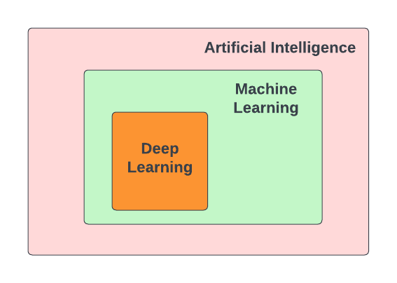
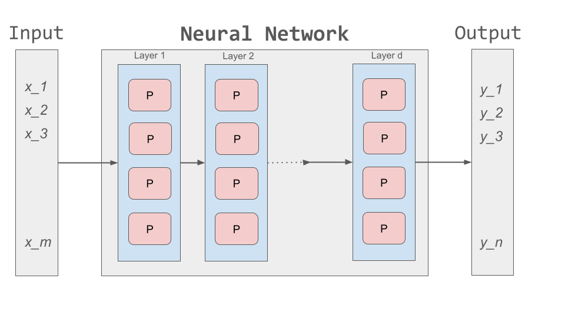
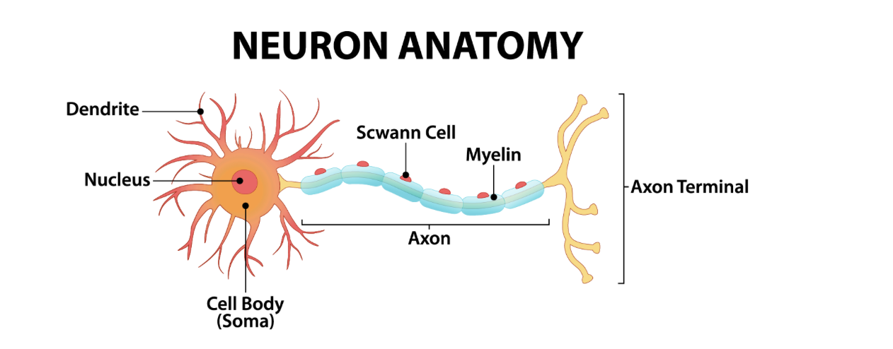
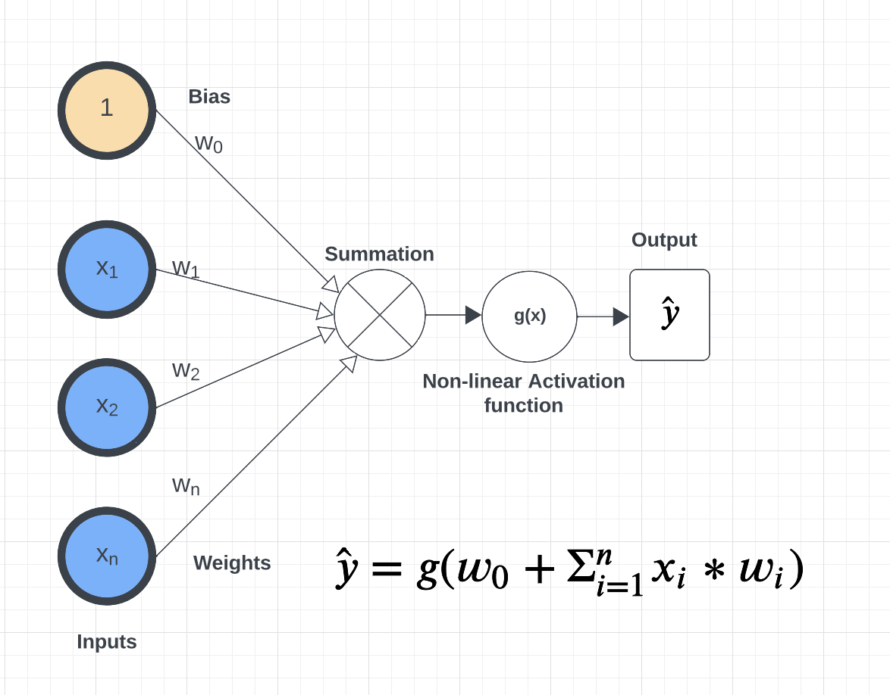
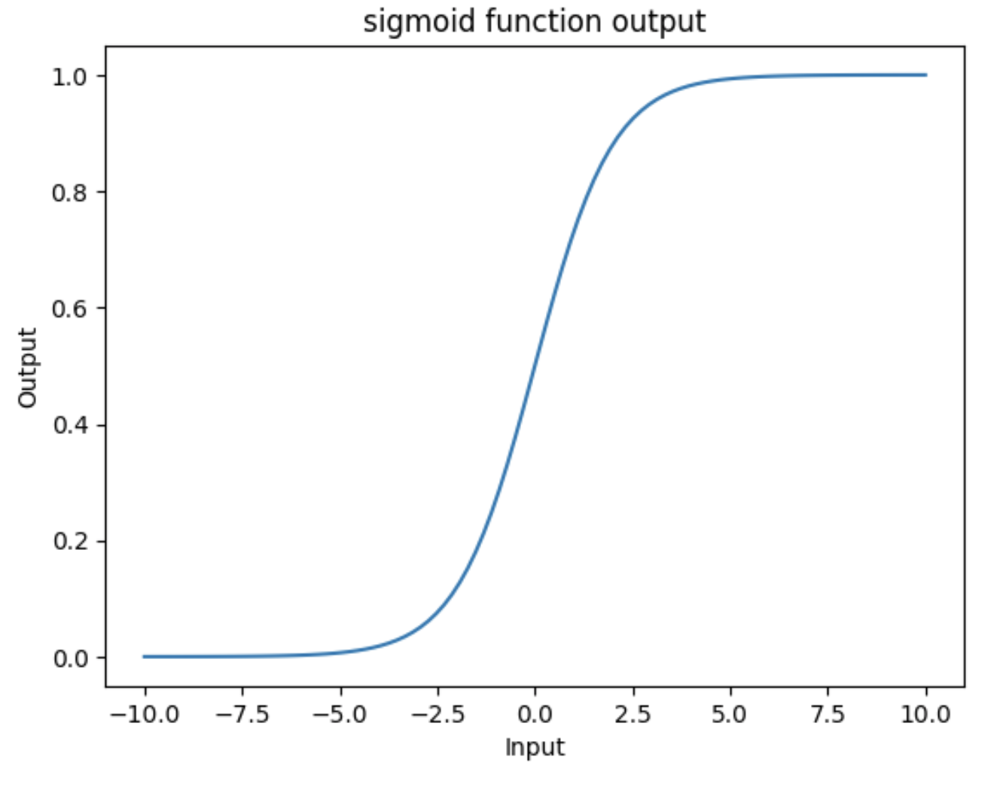
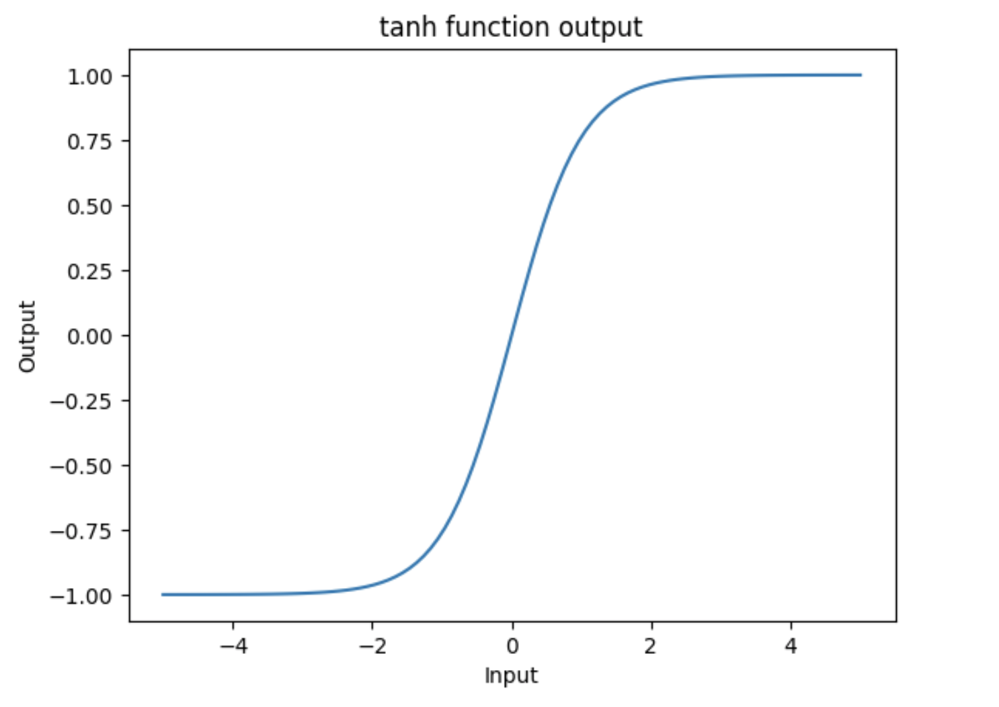
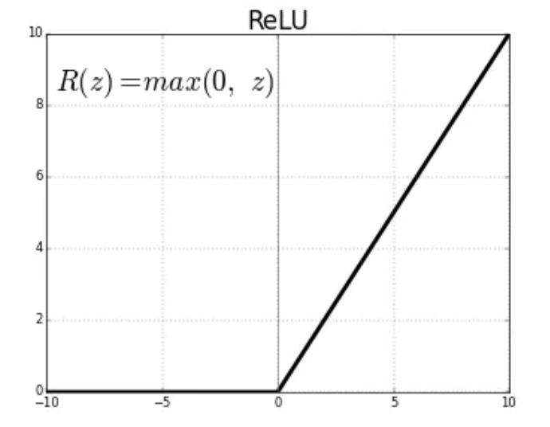
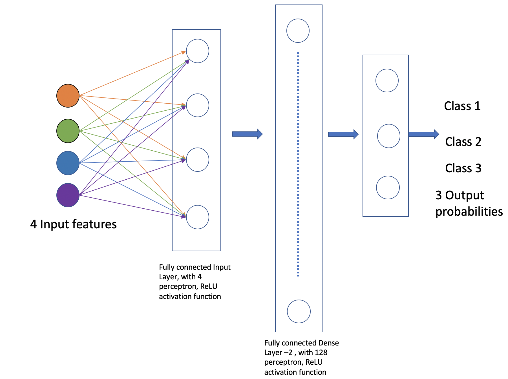

Introduction to Deep Learning
==============================
In this large module, we introduce Artificial Neural Networks (ANNs) and Deep Learning. 
We describe the basic components needed to implement ANNs in Python before introducing the 
Keras API from Tensorflow. We implement a 3-layer ANN to do classification on the Iris data set 
and explore its performance. 

By the end of this module, students should be able to:

1. Describe what ANNs are at a high-level and some tasks they can be used on. 
2. Understand the basic building blocks of an ANN, including the perceptron and various non-linear 
   activation functions, and how to implement an ANN in Python. 
3. Understand how to work with and use an initial portion of the Keras API, including the Sequential 
   model, the Dense layer, and various related methods and parameters. 
4. Create a basic ANN using Karas and train it on a dataset. 

Introduction 
~~~~~~~~~~~~

In recent years, Deep Learning has made remarkable strides. **Deep Learning** is a subfield of 
Machine Learning. Both Deep learning (DL) and Machine learning (ML) are subfields of Artificial
Intelligence (AI). Deep learning has made remarkable progress over the last 10 years or so to 
become one of the most successful areas of AI. Deep Learning makes use 
of **Artificial Neural Networks (ANN)**, which have similarities with the functioning of a 
human brain.
 

Some of the popular applications that have become integral part 
of our everyday lives are:

**Image and Speech recognition:**
Unlocking smartphones through facial recognition; 
Object identification while driving autonomous cars;
Security cameras installed at our houses, smart door bells.

**Natural Language processing (NLP):**
Chatbots like Siri, Google assistants, and Alexa;
Language translation in real-time using Google Translate

**Recommendation systems:**
Netflix and Amazon for movie recommendation. 

**Robotics:**
Humanoid robots doing mundane human tasks. 

The range of applications is extensive, and each of these examples incorporates deep learning in various ways.

**Why do we care about Deep Learning?** 

So far, the datasets we have looked at required features to be engineered by hand. 
For example, the Spambase dataset that we analyzed contained many features
such as word frequency and character frequency that were manually engineered ahead of time for us.
The specific words chosen for the frequencies (there were 48 such) were carefully selected so that 
our ML models could perform moderately well. But from the starting point of the "raw" text emails, 
it is not clear how to engineer those features or which words to choose for the the frequency 
features. 

Extracting meaningful patterns, also known as features, from the data by hand is extremely time 
consuming and non-scalable, and also needs domain knowledge. Using Deep Learning we can delegate 
this responsibility of feature extraction and prediction to the machine.
Deep learning makes use of Artificial neural networks (ANN), so let's try to understand what are ANN.

Artificial Neural Networks (ANN)
~~~~~~~~~~~~~~~~~~~~~~~~~~~~~~~~~~~

Artificial neural networks, or just *neural networks* for short, have been around for several decades. 
But over the last decade or more, the number of applications that make use of neural networks has been 
increasing substantially. So let's try to understand some of the factors 
that have contributed to the increase in use of neural networks in the recent years.

1. Access to machines with GPUs (Graphical Processing Unit) to run compute-intensive Deep Learning algorithms.

   - DL tasks involve high dimensional data such as audio, text and images. Processing and analyzing this 
     data needs intensive mathematical computations (matrix multiplications), which can be efficiently done on GPUs.
     For example, the Nvidia Tesla V100 GPU, has about 670 cores for accelerating AI workloads and is available at an 
     affordable cost.

   - Also, training DL models that have millions or billions of trainable parameters (weights and biases), 
     is faster on GPU versus CPU. 

   
2. Availability of advanced machine learning framework such as ``TensorFlow`` [2]. 
   
   - TensorFlow is an open-source machine learning framework developed by Google. 

   - It provides ecosystem of tools, libraries and resources for building and deploying DL models. 

   - TensorFlow is optimized for performance on GPU and TPU (Tensor Processing Unit - AI accelerator 
     developed by Google for running workloads based off of TensorFlow).

   - With TensorFlow we can build a wide range of ANNs --- from simple, feedforward NNs to 
     complex DL architectures. 

3. Lastly, the internet has led to a large increase in the availability of datasets for training DL models.
   For example, the ImageNet [1] project has provided over 14 million free images, which 
   has helped in advancing computer vision research.

**Basic Idea**

Neural networks are mathematical systems that can learn patterns from data and model real-world 
processes. At the most basic level, a neural network is just a mathematical function that takes 
a numeric input, usually a multi-dimensional array, and returns a numeric output, also usually 
a multi-dimensional array, though typically a different dimension from the input dimension.  

In this sense, a neural network is just another kind of machine learning model like 
the ones we have already studied (Linear Classifiers, KNN, Random Forests, etc.).

The basic architecture of a neural network is depicted below. Inputs are fed to a series of layers,
with each layer composed of a set of *perceptrons*. Within the 
network, intermediate outputs produced by one layer are passed to the next layer as inputs 
before ultimately producing an output.

The following diagram depicts the general structure of an ANN. For the ANN depicted, we say that
the *input dimension* is :math:`m` while the *output dimension* is :math:`n`.

A *perceptron* is the basic building block of a neural network. It is a simple mathematical object which 
can perform computations on numeric values. The definition of a perceptron is inspired from 
neurons in human brain. The human brain has approximately 82 billion neurons, which work in coordination, 
and are capable of making decisions and acting upon it within few seconds, based on the input signals received 
through our senses.

Perceptron
~~~~~~~~~~~
A *perceptron* is analogous to a single neuron. As mentioned, neural networks are comprised of 
layers of perceptrons. This perceptron is very much like the perceptron algorithm we discussed in Unit 2 
when covering linear classification. 
The basic architecture of a perceptron is depicted below. 

As you can see from the figure above, a perceptron takes an input :math:`x= [x_i]`, of a fixed length, `n`, (that 
is :math:`i= 1,...,n`), 
and maintains a set of *weights*, :math:`w=[w_i]`, of the same length, :math:`n`. Each input is
multiplied by the corresponding weight. For example, :math:`x_1*w_1`, 
:math:`x_2*w_2`, and so on to :math:`x_n*w_n`. We sum the products and finally add the 
:math:`w_0` term, called the *bias*.
Mathematically, the bias term represents the y-intercept of the linear equation associated with the perceptron. 
The bias together with the set of weights (i.e., the set of values :math:`w_0, w_1,...,w_n`) are referred 
to as the parameters of the perceptron. 

Finally, the output is then passed to a non-linear function also known as the *activation function*.
This is the key improvement over the linear classification model we discussed in Unit 2. 

**Why do we need non-linear functions?**
The patterns in the data we encounter in the real world are typically highly non-linear. 
To extract meaningful patterns from these datasets, we need models that are non-linear.
In the upcoming lectures we will cover different types of activation functions such as 
``sigmoid``, ``tanh``, ``ReLU``, and ``softmax``. 

Inference and Training
~~~~~~~~~~~~~~~~~~~~~~

**Inference.**
Inference refers to the process of making predictions, decisions, or drawing conclusions based 
on a trained model and input data.
Given an input, :math:`x=(x_1, ..., x_n)`, we can pass it through a neural network whose first 
layer has number of perceptrons of the same dimension :math:`n`. Each perceptron produces an output 
:math:`y` which can in turn be passed to any number of perceptrons in another layer, which in turn 
produces additional outputs. This process continues until reaching the output layer where a final 
result is computed. The final output is an array of numeric values. 

For classification problems, we impose a scheme to derive a class label from a numeric value in the 
output. As discussed in Unit 2, we can make use of the notion of a *decision function* where, for a 
specific class label, *C*, we predict :math:`x\in C` based on the sign of the decision function --- 
if the output is positive, we predict :math:`x\in C` while if the output is negative, we predict 
:math:`x\not\in C`. Binary classification problems make use of one decision function while multi-label 
classification problems use one decision function for each possible label. 

**Training.** How should we choose values for the parameters (i.e., the :math:`w_0, w_1,...,w_n` for
each perceptron)
to produce a neural network that is a good predictor? Just like with other models we have seen, 
we begin with random values for the weights and iteratively adjust them based some labeled data.
This process is referred to as "model training" and is a case of supervised learning since we are 
supplying labeled data. 

The basic idea is similar to other models: we define an error function and associated cost function 
and iteratively minimize it by updating the parameters. As in the other cases, we use gradient 
descent to update the parameters in the opposite direction of the gradient. 

If :math:`E` is the error function, then conceptually, given some parameter :math:`w`, we 
would like to update it like so: 

.. math:: 

    w_{new} := w_{prev} - \alpha\frac{\partial E}{\partial w}

where :math:`\alpha` is some small number, often between 0 and 1 (this is called the "learning rate") and 
:math:`\frac{\partial E}{\partial w}` is the partial derivation of :math:`E` with respect to :math:`w`. 

We find the weights that reduces the error for the entire network. Time permitting we will go over the
basics of backpropogation given in the Supplementary material in this lecture. 

Building A Neural Network By Hand
~~~~~~~~~~~~~~~~~~~~~~~~~~~~~~~~~~

What would it take to build a neural network from basic libraries like numpy? We won't implement a 
complete solution, but let's take a look 
at some of the basic building blocks that we would need.  

Implementing a Perceptron and Layer
^^^^^^^^^^^^^^^^^^^^^^^^^^^^^^^^^^^
To implement a neural network, at a minimum we would need functions to:

1. Create individual perceptrons of a specific size (i.e., *dimension*)
   and initialize and maintain the weights as well as a bias term.
2. Create layers in our network comprised of a certain number of perceptrons 
   as well as the non-linear activation function to use.
3. Compute the output of a layer for some input of the appropriate shape. 

We could implement a perceptron using a numpy array to hold the weights and bias:

.. code-block:: python3 

    def create_perceptron(dim):
        """
        Create a perceptron of dimension `dim` and initialize it with random weights. 
        """
        # we use dim+1 because we want to have a bias term and `dim` weights
        return np.random.random(dim+1)

We could then implement a layer as a certain number of perceptrons with an activation function: 

.. code-block:: python3 

    def create_layer(num_perceptrons, dim, activation_function):
        """
        Create a layer of `num_perceptrons` perceptron, each of dimension `dim` with activation function `activation_function`.
        Initialize the weights of all perceptrons to a random float between 0 and 1. 
        """
        # represent the layer as a list of dictionary of perceptrons
        layer = []
        for i in range(num_perceptrons):
            layer.append({"weights": create_perceptron(dim), "activation_function": activation_function})
        return layer

We need a way to compute the output of a layer from an input. To do that though, we first need to say a little 
more about activation functions. Let's look at the `sigmoid` activation function in a little more detail. 

The ``sigmoid`` Activation Function
^^^^^^^^^^^^^^^^^^^^^^^^^^^^^^^^^^^
Let's look at the ``sigmoid`` activation function. Mathematically, ``sigmoid`` function is defined as:

.. math::

    f(z) =  \frac{\mathrm{1} }{\mathrm{1} + e^{-z}}

Let's try to write this as a helper function using Python. The code is pretty simple.
You just import numpy and implement the above formula. 
The sigmoid function returns a value between 0 and 1, which can be interpreted as a probability.   

.. code-block:: python3 

    import numpy as np

    def sigmoid(x):
        return 1.0 / (1 + np.exp(-x))

Next, let's try to plot the sigmoid function. 

.. code-block:: python3

    # Import matplotlib, numpy and math 
    import matplotlib.pyplot as plt 
    import numpy as np 
    import math 
    
    x = np.linspace(-10, 10, 100) 
    
    plt.plot(x, sigmoid(x)) 
    plt.xlabel("x") 
    plt.ylabel("Sigmoid(X)") 
    
    plt.show() 

What does the code :code:`x = np.linspace(-10, 10, 100)` do?

What can you infer about the output from the plot? Try giving it a different range (e.g., -6 and 6)?
It takes any range of real numbers and returns the output value which falls in the range of 0 to 1. 

In summary, the sigmoid function's key features are: 

* Is differentiable  
* Maps almost all values to a value either very close to 0 or very close 1. 

Therefore, sigmoid can be used as a decision function for classification problems. 

The ``tanh`` activation function
^^^^^^^^^^^^^^^^^^^^^^^^^^^^^^^^^
The ``tanh`` function is similar to sigmoid, but can be a better choice to use 
for intermediate layers because its values are centered around zero.
Mathematically, ``tanh`` can be defined as follows: 

.. math:: 

    f(x) = \frac{e^x - e^{-x}} {e^x + e^{-x}}

The range of the tanh function is from (-1 to 1). 
The advantage is that the negative inputs will be mapped strongly negative and the zero inputs 
will be mapped near zero in the tanh graph.

In summary, the tanh function: 

* Is differentiable  
* Has values centered around 0.
* Maps almost all values to a value either very close to -1 or very close 1.

The ``ReLU`` (Rectified Linear Unit) activation function
^^^^^^^^^^^^^^^^^^^^^^^^^^^^^^^^^^^^^^^^^^^^^^^^^^^^^^^^^
The Rectified Linear Unit function, referred to as "ReLU", is among the most popular and activation 
functions used today. It is used in almost all the 
Convolutional Neural Networks (CNNs) which we will introduce in an upcoming lecture. 

The ReLU is defined as follows: 

.. math:: 

    f(x) = max(0, x) = \frac{ x + |x|} {2}

The range of the ReLU function is the Real interval :math:`[0, \infty]`.
Moreover, the function is zero when :math:`x` is less than zero and is equal to :math:`x` 
when :math:`x` is positive.

The Softmax Activation Function 
^^^^^^^^^^^^^^^^^^^^^^^^^^^^^^^^

The softmax function is a very popular activation function for multiclass classification 
problems. Its formula is given by: 

.. math:: 

    f(z)_i = \frac {e^{z_i}} {\sum_{j=1}^K e^{z_j} }

where :math:`K` is the length of the vector. 
The way to interpret this function is that it takes an arbitrary vector of real numbers 
and converts it to a probability distribution over $K$ possible outcomes. 

Creating Layers and Computing the Output of Layers 
^^^^^^^^^^^^^^^^^^^^^^^^^^^^^^^^^^^^^^^^^^^^^^^^^^
Now that we know how to implement an activation function, we can create a layer with it using 
the ``create_layer`` function we defined previously. For example, let's create a layer with 
5 perceptrons of dimension 3 using the sigmoid activation function we just defined:

.. code-block:: python3 

    >>> l1 = create_layer(5, 3, sigmoid)

Next, we need to implement a function to compute the output of a layer from the input of 
another layer. Given an input, ``X``, we need to iterate over all of the perceptrons in 
the layer and compute the dot product with its weights :math:`w_1,...,w_n` -- note we are 
starting with :math:`w_1`, **not** :math:`w_0`. We then need to add the :math:`w_0` term, 
as this is the bias before applying the activation function. The ultimate result will be 
an array of outputs, one for each perceptron in the layer. 

Here is an example implementation: 

.. code-block:: python3 

    def compute_output_for_layer(X, layer):
        """
        Compute the output of a layer for some input, `X`, a numpy array of dimension equal to the
        dimension of the perceptrons in the layer, `layer`. 
        """
        # our result will be a list of outputs for each perceptron
        result = []
        # for each perceptron in the layer
        for p in layer:
            # compute the dot product of the input with weights w_1, .., w_n and add the bias, w_0
            out = np.dot(X, p['weights'][1:]) + p['weights'][0]
            # then, apply the activation function 
            result.append(p['activation_function'](out))
        return result    

We can now create an input and compute the output of our layer: 

.. code-block:: python3 

    >>> X = [0.8, -2.3, 2.15]
    >>> o1 = compute_output_for_layer(X, l1)
    >>> o1
    [0.294773293601466,
    0.29064381699480163,
    0.7720800756699581,
    0.9238752623623957,
    0.4755367087316097]

Note that the output is an array of length 5. Why is that? 

It's because there were 5 perceptrons in the layer, ``l1``. So this is an important point: the 
dimension of the output of a layer is equal to the number of perceptrons in the layer, but this in  
turn can be different from the input dimension of the layer, which is the dimension of each perceptron.

If we wanted to add a second layer to our network, we could do that. To pass the output of the first 
layer to the input of the next layer, we require the input dimension of the perceptrons in the next 
layer to be the same input dimension as the output dimension. As we have just seen, assuming we want 
a *fully connected* network, where the output of every perceptron in one layer is passed as an 
input to every perceptron in the next layer, then the input dimension of the next layer must equal 
the number of of perceptrons in the previous layer. 

.. note:: 

    *Fully-connected* ANNs, also called *dense*, are a specific type of model architecture. 
    Later in this unit, we will see other architectures, such as CNN. 

In the code below, we create a second layer with 2 perceptrons of dimension 5. 

.. code-block:: python3 

    >>> l2 = create_layer(2, 5, sigmoid)

We can pass the output of ``l1`` as the input to ``l2``:

.. code-block:: python3 

    >>> o2 = compute_output_for_layer(o1, l2)
    >>> o2 
    [0.8332717112765128, 0.8277819032135856]

Again, we see the output dimension of 2 equals the number of perceptrons in the layer. 

Proceeding in this way, we could create networks of arbitrary depth. Of course, we would also need 
a way to update the weights based on input samples (i.e., training data). Fortunately, we can use a 
library that makes all of this much easier. 

TensorFlow
~~~~~~~~~~~

A very powerful python library for building neural networks called **TensorFlow** is 
available for us to use. Developed by Google, TensorFlow provides both a low-level and a high-level API. 
The high-level API is referred to as Keras and is the API you will almost always want to use unless 
you are implementing your own algorithms for low-level tasks, such as training. We will look at 
Keras in the next section, but in this section we give a quick introduction to the low-level TensorFlow
API.

We begin by importing the library. It is customary to import tensorflow as ``tf``:

.. code-block:: python3 

    import tensorflow as tf 

The basic building block in TensorFlow is the *tensor*. Some of you studying Physics may have
heard of tensors in terms of its use in General Relativity. For this class,
let's just stick to defining tensors as multi-dimensional arrays with a uniform datatype.
You can think of tensors as similar to numpy's ndarrys. 

**In-Class Exercise:** Before we move on, lets create some basic tensors.

1. *Rank-0 or scalar Tensor*. It is a scalar with constant value and no axes.

.. code-block:: python3 

    >>> rank_0_tensor = tf.constant(4)
    >>> print(rank_0_tensor)

If you run the code above, the output should be:  

.. code-block:: python3 

    tf.Tensor(4, shape=(), dtype=int32)

From Linear Algebra you may recall that scalars only have magnitude but no direction. Hence, a rank-0 or
scalar tensor has no shape.

2. *Rank-1 tensor*. You can think of a rank-1 tenant as just a 1-D array.

.. code-block:: python3 

    # Let's make this a float tensor.
    >>> rank_1_tensor = tf.constant([2.0, 3.0, 4.0])
    >>> print(rank_1_tensor)

What is the output of above code?

Can you construct a rank-2 tensor or simply a 2X3 matrix?

.. code-block:: python3 

    >>> rank_2_tensor = tf.constant([[1,2,4],
                                     [5,6,7]])
    >>> print(rank_2_tensor)

Similarly, we can create higher order tensors. See the documentation for more information [3].

TensorFlow also provides implementations of the mathematical functions which we will be 
using when building Neural Networks. For example, we can use off the shelf TensorFlow functions 
for the activation functions we want to use in our perceptrons.

Examples:

.. code-block:: python3 

    tf.math.sigmoid
    tf.math.tanh
    tf.nn.relu

You would have noticed the last one is taken from the neural networks API (i.e., the ``nn`` module) 
of TensorFlow.
You can also get similar APIs from **TensorFlow Keras**, which we are also going to use  
for building Neural Networks.

Let's try to build a simple neural network using Keras.

Building a First Neural Network with TensorFlow Keras
~~~~~~~~~~~~~~~~~~~~~~~~~~~~~~~~~~~~~~~~~~~~~~~~~~~~~

TensorFlow Keras refers to the high-level neural networks API provided by TensorFlow. 
Keras is integrated directly into TensorFlow, making it easy to build and train neural 
networks with TensorFlow as the backend. Keras covers every step of machine learning from data 
preprocessing to hyperparameter tuning
to deployment. Every TensorFlow user should use Keras by default, unless they are building their tools on 
top of TensorFlow.

The core data structures of Keras are ``Models`` and ``Layers``. As we have seen, conceptually, a layer 
is just an input/output transformation; a model is a directed acyclic graph (DAG) of layers. 

Layers encapsulate the weights and biases we discussed above, while a model groups layers together and 
defines how layers 
are connected to each other. Additionally, a model can be trained on data.

The simplest model is the ``Sequential`` model, which is a linear stack of layers. 

.. You can build complex architectures with the Keras functional API, or use subclassing to write models from scratch.  

In the example below, you will see how easy it is to build a simple neural network
with Keras. We will build a ``Sequential`` model to classify the Iris dataset we looked at in Unit 2. 

Loading the Data
^^^^^^^^^^^^^^^^

Before we get started building the model, let's import the dataset and remember its basic characteristics: 

.. code-block:: python3 

    from sklearn import datasets
    iris = datasets.load_iris()
    
    # the independent variables 
    iris.data.shape
    #(150, 4)

    # the dependent variables 
    iris.target.shape
    #(150, 0)

Let's split the data into train and test sets and one hot encode the target variable. Note that 
we are using the ``to_categorical`` function from the ``utils`` module of Keras. In general, it 
is always a good idea to use pre-processing functions and other utilities from the same library
that you will be using for model development. 

.. code-block:: python3 

    from sklearn.model_selection import train_test_split
    from tensorflow.keras.utils import to_categorical

    X = iris.data
    y = iris.target

    X_train, X_test, y_train, y_test = train_test_split(X, y, test_size=0.2, stratify=y, random_state=1)

    y_train_encoded = to_categorical(y_train)
    y_test_encoded = to_categorical(y_test)

Building the Model 
^^^^^^^^^^^^^^^^^^

Step 1: Import Modules from Keras and Initialize the Model
^^^^^^^^^^^^^^^^^^^^^^^^^^^^^^^^^^^^^^^^^^^^^^^^^^^^^^^^^^
The simplest type of model is the Sequential model, which is a linear stack of layers. 
Since we will be creating a sequential neural network model we import Sequential from Keras.model. 
We will also have one or more densely connected hidden layer, hence we import Dense from Keras.Layers.

.. code-block:: python3 

    from keras.models import Sequential
    from keras.layers import Dense

We use the ``Sequential()`` constructor to create a new model object: 

.. code-block:: python3 

    model = Sequential()

Step 2: Add Layers to the Model
^^^^^^^^^^^^^^^^^^^^^^^^^^^^^^^

We add layers to the model using the ``add`` method. In this case:

* The first layer added is a dense (fully connected) layer with 4 perceptrons and an input_dim=4. 
  We could have chosen any number of perceptrons here, but we must specify an input dimension since it is the 
  first layer. Moreover, the input dimension must match the shape -- i.e., number of features -- of our input.
  Since there are 4 features in the Iris dataset, we use an input dimension of 4. Finally, we use the 
  ``ReLU`` activation function. 
* The second layer added is another dense layer with 128 perceptrons. Note that we do not specify an input 
  dimension because Keras can infer the dimension because it must match the output dimension from the 
  previous layer. (Question: what should the input dimension be)?
* The third layer will be the last layer in our model. This layer represents the output layer so we need 
  the output dimension (i.e., the number of perceptrons) to match the number of labels in our target.
  Since there are 3 possible labels (0, 1 and 2), we use a layer with 3 perceptrons. And again, like the previous 
  layer, we do not need to specify the input dimension as it can be inferred from the output dimension 
  of the previous layer. Finally, we use the softmax activation function. 

.. code-block:: python3 

    # Our input layer can have any number of perceptrons, we chose 4, however,
    # the input dimension must match the number of features in the independent variable -- therefore, we set 
    # it to 4
    model.add(Dense(4, input_dim=4, activation='relu'))

    # we can add any number of hidden layers with any number of perceptrons; here we choose 1 layer with 128 perceptrons. The
    # hidden layers should all use RELU
    model.add(Dense(128, activation='relu'))

    # softmax activation function is selected for multi-label classification problems; there are 3 perceptrons in this
    # last layer because there are 3 target labels to predict (it matches the shape of y)
    model.add(Dense(3, activation='softmax'))

Step 3: Compile the Model and Check Model Summary 
^^^^^^^^^^^^^^^^^^^^^^^^^^^^^^^^^^^^^^^^^^^^^^^^^^
The next step is to compile the model using the ``compile`` method. With compile, you can configure the model for 
training. The ``model.compile`` function accepts a number of arguments. We begin by 
introducing the following important arguments. For a complete list, see the Keras documentation for 
compile `here <https://www.tensorflow.org/api_docs/python/tf/keras/Model#compile>`_.

``optimizer``: This parameter specifies the optimizer to use during training. Optimizers are algorithms or 
methods that are used to update the parameters of the neural network during training to minimize the loss function.
Examples: ``adam``, ``rmsprop``, ``sgd``. At a high level, these different options trade convergence speed 
for computational resources required. Commonly, ``adam`` is often considered the best choice, at least to 
start with. 

``loss``: This parameter specifies the loss function to use during training. The loss function measures how well the model performs on the training data and guides the optimizer in adjusting the model's parameters.
Examples: ``sparse_categorical_crossentropy``, ``mean_squared_error``, ``binary_crossentropy``, 
``categorical_crossentropy``, etc.
The choice of loss function depends on the type of task the network is being trained for, e.g., 

1. Binary Classification: typically one uses ``binary_crossentropy``. 
2. Multi-Class Classification: either ``categorical_crossentropy``, or ``sparse_categorical_crossentropy``
3. Regression: typically, either ``mean_squared_error``, or ``mean_absolute_error``.

``metrics``: This parameter is a list of metrics to evaluate the model's performance during training and testing.
Examples: ``accuracy``, ``precision``, ``recall``, etc., passed as a list. 

You need to provide appropriate values for these parameters based on your specific task and model architecture.

In the Iris example when we compile the model, we specify optimizer (``adam``), the loss function 
(``categorical_crossentropy``, suitable 
for multi-label classification problems), and metrics to evaluate during training (``accuracy``).

Time permitting we will look at different types of optimizers.

.. code-block:: python3 

    model.compile(optimizer='adam', loss='categorical_crossentropy', metrics=['accuracy'])

Let's now print and explore the model summary:

.. code-block:: python3 

    model.summary()

The output should look similar to the following: 

.. code-block:: python3

    Model: "sequential"
    _________________________________________________________________
    Layer (type)                Output Shape              Param #   
    =================================================================
    dense (Dense)               (None, 4)                 20        
                                                                    
    dense_1 (Dense)             (None, 128)               640      
                                                                    
    dense_2 (Dense)             (None, 3)                 387       
                                                                    
    =================================================================
    Total params: 1047 (4.09 KB)
    Trainable params: 1047 (4.09 KB)
    Non-trainable params: 0 (0.00 Byte)
    
    
Let's break down the summary:

**Model.** The type of model of listed, in this case it is a Sequential model.

**Layer (type).** 
Each layer in the model is listed along with its type. For example, "dense"
indicates a fully connected layer. Recall that we had 3 total layers: one input layer with 
4 perceptrons, one "hidden" layer with 128 perceptrons, and one
output layer with 3 perceptrons. 

**Output Shape.** The output shape of each layer. For each of our layers, a tuple with two values 
is provided; for example, the ``(None, 4)`` in the first layer. 
The ``4`` here is indicating that the output has 4 values, which is what we would expect (why?)
The ``None`` refers to the fact that the layer accepts a variable *batch size* --- we will look at the 
batch size concept momentarily.

Note that the output dimension is the same as the number of perceptrons for the layer, since each 
perceptron produces a single output value. 

**Param #.** The total number of parameters (weights and biases) in each layer.
For example, in the first dense layer there are 4 perceptrons, 
the input dimension was 4 and there is a 1 bias term with each perceptron. Therefore, the first layer has a total of 
:math:`4*(4+1) = 20` parameters. 

Similarly, the second layer has 128 perceptrons each with an input dimension equal to the output dimension of 
the first layer, which is 4. Thus, each of the 128 perceptrons has :math:`4+1=5` total parameters (4 weights and 
1 bias parameter), and therefore the entire layer has :math:`128*5 = 640` parameters. 

*Exercise.* Convince yourself that there are 387 parameters in the last layer. 

*Solution.* In general, for a dense or fully connected layer, since every perceptron in the previous layer 
provides its output as an input to each perceptron, and since a perceptron produces a single output value, 
the input dimension equals the number of perceptrons in the previous layer. Thus, for layer 3, since 
there were 128 perceptrons in layer 2, the input dimension is 128 and that is the number of weights on each 
perceptron. Since each perceptron also has a single bias parameter, there are a total of 129 parameters for 
each perceptron in layer 3. Finally, since there are 3 perceptrons in layer 3, the total number of parameters 
is :math:`3*129 = 387`.

Step 4: Train the model. 
^^^^^^^^^^^^^^^^^^^^^^^^

Just like when using sklearn, once we have our model constructed we are ready to train the model. We use the 
``fit()`` function, like with sklearn, but keep in mind this is a different ``fit()`` function that takes different 
arguments. We'll look at just a few of the more important ones here: 

* ``x`` and ``y`` -- The input and target data, respectively. A number of valid types can be passed here, 
  including numpy arrays, TensorFlow tensors, Pandas DataFrames, and others. 
* ``epochs`` -- The total number of complete passes over the entire training dataset that will be performed 
  during training.
* ``batch_size`` -- This is the number of samples per gradient to use before updating the model's 
  parameters (weights and biases). Smaller batch sizes require less computational resources, especially 
  memory, and can help with finding global maximum values but can also greatly increase the time required 
  for the model to converge. 

* ``validation_split`` -- The percentage, a a float, of the dataset to hold out for validation. Keras will
  compute the validation score at the end of each epoch. 
* ``verbose`` -- (0, 1, or 2). An integer controlling how much debug information is printed during training. 
  A value of 0 suppresses all messages. 

.. code-block:: python3 

    >>> model.fit(X_train, y_train_encoded, validation_split=0.1, epochs=20, verbose=2)

    Epoch 1/20
    4/4 - 2s - loss: 1.1249 - accuracy: 0.3519 - val_loss: 1.0253 - val_accuracy: 0.5000 - 2s/epoch - 611ms/step
    Epoch 2/20
    4/4 - 0s - loss: 1.0801 - accuracy: 0.3519 - val_loss: 1.0169 - val_accuracy: 0.5000 - 172ms/epoch - 43ms/step
    Epoch 3/20
    4/4 - 0s - loss: 1.0709 - accuracy: 0.3519 - val_loss: 1.0191 - val_accuracy: 0.5000 - 168ms/epoch - 42ms/step
    Epoch 4/20
    4/4 - 0s - loss: 1.0632 - accuracy: 0.3519 - val_loss: 0.9996 - val_accuracy: 0.5000 - 108ms/epoch - 27ms/step
    Epoch 5/20
    4/4 - 0s - loss: 1.0529 - accuracy: 0.3519 - val_loss: 0.9879 - val_accuracy: 0.5000 - 67ms/epoch - 17ms/step
    Epoch 6/20
    4/4 - 0s - loss: 1.0382 - accuracy: 0.3519 - val_loss: 0.9851 - val_accuracy: 0.5000 - 60ms/epoch - 15ms/step
    Epoch 7/20
    4/4 - 0s - loss: 1.0252 - accuracy: 0.3519 - val_loss: 0.9656 - val_accuracy: 0.5000 - 59ms/epoch - 15ms/step
    Epoch 8/20
    4/4 - 0s - loss: 1.0138 - accuracy: 0.3519 - val_loss: 0.9580 - val_accuracy: 0.5000 - 44ms/epoch - 11ms/step
    Epoch 9/20
    4/4 - 0s - loss: 0.9976 - accuracy: 0.3704 - val_loss: 0.9508 - val_accuracy: 0.5833 - 59ms/epoch - 15ms/step
    Epoch 10/20
    4/4 - 0s - loss: 0.9806 - accuracy: 0.5093 - val_loss: 0.9383 - val_accuracy: 0.5833 - 43ms/epoch - 11ms/step
    Epoch 11/20
    4/4 - 0s - loss: 0.9630 - accuracy: 0.6204 - val_loss: 0.9244 - val_accuracy: 0.7500 - 43ms/epoch - 11ms/step
    Epoch 12/20
    4/4 - 0s - loss: 0.9414 - accuracy: 0.6667 - val_loss: 0.9122 - val_accuracy: 0.7500 - 67ms/epoch - 17ms/step
    Epoch 13/20
    4/4 - 0s - loss: 0.9172 - accuracy: 0.6852 - val_loss: 0.8912 - val_accuracy: 0.7500 - 60ms/epoch - 15ms/step
    Epoch 14/20
    4/4 - 0s - loss: 0.8898 - accuracy: 0.6852 - val_loss: 0.8648 - val_accuracy: 0.7500 - 46ms/epoch - 11ms/step
    Epoch 15/20
    4/4 - 0s - loss: 0.8599 - accuracy: 0.6852 - val_loss: 0.8314 - val_accuracy: 0.7500 - 63ms/epoch - 16ms/step
    Epoch 16/20
    4/4 - 0s - loss: 0.8294 - accuracy: 0.6852 - val_loss: 0.7960 - val_accuracy: 0.7500 - 63ms/epoch - 16ms/step
    Epoch 17/20
    4/4 - 0s - loss: 0.7998 - accuracy: 0.6852 - val_loss: 0.7767 - val_accuracy: 0.7500 - 44ms/epoch - 11ms/step
    Epoch 18/20
    4/4 - 0s - loss: 0.7692 - accuracy: 0.6852 - val_loss: 0.7561 - val_accuracy: 0.7500 - 59ms/epoch - 15ms/step
    Epoch 19/20
    4/4 - 0s - loss: 0.7445 - accuracy: 0.6852 - val_loss: 0.7424 - val_accuracy: 0.7500 - 44ms/epoch - 11ms/step
    Epoch 20/20
    4/4 - 0s - loss: 0.7152 - accuracy: 0.6852 - val_loss: 0.7106 - val_accuracy: 0.7500 - 61ms/epoch - 15ms/step

.. warning::

    As mentioned above, the choice of ``batch_size`` can affect the memory usage while fitting the model. 
    Bigger batch sizes can sometimes cause out of memory (OOM) errors. If run into OOM errors, consider 
    reducing the value of ``batch_size``. 

You can read more about the parameters available to the ``fit()`` function in the documentation [6].

Step 5: Evaluate the model on test data
^^^^^^^^^^^^^^^^^^^^^^^^^^^^^^^^^^^^^^^^^^^^

We evaluate the model's performance on test dataset using the evaluate method.

.. code-block:: python3

    # Evaluate the model on the test set
    test_loss, test_accuracy = model.evaluate(X_test, y_test_encoded, verbose=0)
    print("Test Loss:", test_loss)
    print("Test Accuracy:", test_accuracy)

    Test Loss: 0.653412401676178
    Test Accuracy: 0.699999988079071

Notice that the accuracy scores on test are quite low. Let's look more closely at the output from our called
to ``fit()``. We see that, even on the training data, the accuracy is not very good. Here is the 
tail end of the output logs: 

.. code-block:: python3 

    Epoch 16/20
    4/4 - 0s - loss: 0.7497 - accuracy: 0.8148 - val_loss: 0.7383 - val_accuracy: 0.8333 - 21ms/epoch - 5ms/step
    Epoch 17/20
    4/4 - 0s - loss: 0.7296 - accuracy: 0.7500 - val_loss: 0.7095 - val_accuracy: 0.8333 - 21ms/epoch - 5ms/step
    Epoch 18/20
    4/4 - 0s - loss: 0.7103 - accuracy: 0.7037 - val_loss: 0.6804 - val_accuracy: 0.8333 - 21ms/epoch - 5ms/step
    Epoch 19/20
    4/4 - 0s - loss: 0.6894 - accuracy: 0.6944 - val_loss: 0.6591 - val_accuracy: 0.7500 - 21ms/epoch - 5ms/step
    Epoch 20/20
    4/4 - 0s - loss: 0.6715 - accuracy: 0.6667 - val_loss: 0.6367 - val_accuracy: 0.7500 - 21ms/epoch - 5ms/step

The snippet above indicates that the training accuracy was around 70\% during the last few epochs. 
If we review the entire log set, we'll see that the accuracy was generally increasing, having started 
off around 35\%. Note that the exact numbers will differ slightly due to the randomized nature of the 
algorithm. 

This perhaps is suggesting that we didn't train *enough*, that is, that we stopped the training process 
before we had reached an optimal network. Remember that we hard-coded a specific number of epochs -- 20 -- 
to do during training. 

Let's go back and retrain the model with a larger number of epochs and see if that improves the performance. 
Below, I specify ``epochs=100``. 

.. code-block:: python3 

    model.fit(X_train, y_train_encoded, validation_split=0.1, epochs=100, verbose=2)

    . . . 

    Epoch 97/100
    4/4 - 0s - loss: 0.1854 - accuracy: 0.9352 - val_loss: 0.1244 - val_accuracy: 0.9167 - 21ms/epoch - 5ms/step
    Epoch 98/100
    4/4 - 0s - loss: 0.1861 - accuracy: 0.9352 - val_loss: 0.1275 - val_accuracy: 0.9167 - 22ms/epoch - 5ms/step
    Epoch 99/100
    4/4 - 0s - loss: 0.1845 - accuracy: 0.9352 - val_loss: 0.1225 - val_accuracy: 0.9167 - 22ms/epoch - 5ms/step
    Epoch 100/100
    4/4 - 0s - loss: 0.1824 - accuracy: 0.9352 - val_loss: 0.1242 - val_accuracy: 0.9167 - 21ms/epoch - 5ms/step

The accuracy on the training set indeed gets much better. Let's also look at 
the corresponding results on test: 

.. code-block:: python3 

    test_loss, test_accuracy = model.evaluate(X_test, y_test_encoded, verbose=0)
    Test Loss: 0.22188232839107513
    Test Accuracy: 0.8999999761581421

Indeed, the results have improved. How do we know if this is the optimal result? 
In general, determining the optimal number of epochs must be handled on a case-by-case 
basis. A goog basic approach is the following: 1) set a very high number of epochs, more 
than should be required to achieve optimal performance; 2) monitor the performance 
of the model during training on the validation set; 3) quit when valiation performance 
begins to decrease (overfitting starts to take place).

In a future lecture, we'll look at methods for implementing this strategy using, for example, 
the ``EarlyStopping`` functionality from Keras. 

Sensitivity to Randomized Values and Initial Conditions 
^^^^^^^^^^^^^^^^^^^^^^^^^^^^^^^^^^^^^^^^^^^^^^^^^^^^^^^
You may see quite different outputs/values when you execute the code above. For example, 
on a different execution of the same code, I saw the following output. 

.. code-block:: python3

    . . . 
    Epoch 17/20
    4/4 - 0s - loss: 0.5573 - accuracy: 0.8611 - val_loss: 0.4950 - val_accuracy: 0.8333 - 20ms/epoch - 5ms/step
    Epoch 18/20
    4/4 - 0s - loss: 0.5371 - accuracy: 0.8519 - val_loss: 0.4696 - val_accuracy: 0.8333 - 21ms/epoch - 5ms/step
    Epoch 19/20
    4/4 - 0s - loss: 0.5186 - accuracy: 0.8241 - val_loss: 0.4472 - val_accuracy: 0.8333 - 20ms/epoch - 5ms/step
    Epoch 20/20
    4/4 - 0s - loss: 0.5017 - accuracy: 0.8241 - val_loss: 0.4263 - val_accuracy: 0.8333 - 20ms/epoch - 5ms/step

This underscores the importance of understanding the output and making careful decisions 
about how to proceed. 

Conclusion 
^^^^^^^^^^

With these steps we were able to set up a simple feedforward neural network using Keras 
with three dense layers (an input, hidden and output layer), specify the model's architecture, 
and compilation parameters, and fit the model to some data. We also explored one of the 
parameters, ``epochs``, and saw how it could make a significant difference on the performance 
of the resulting model, even for a very simple dataset such as the Iris dataset. 

**Take-Home Exercise:** Can you walk through this code and tell what's happening?

.. code-block:: python3

    from keras.models import Sequential
    from keras.layers import Dense

    model = Sequential()

    model.add(Dense(64, input_dim=10, activation='relu',))
    model.add(Dense(32, activation='relu'))
    model.add(Dense(1, activation='sigmoid'))

    model.summary()

Supplement: Feed-Forward Networks and Backpropagation
~~~~~~~~~~~~~~~~~~~~~~~~~~~~~~~~~~~~~~~~~~~~~~~~~~~~~~
If :math:`E` is the error function, then conceptually, given some parameter :math:`w`, we 
would like to update it like so: 

.. math:: 

    w_{new} := w_{prev} - \alpha\frac{\partial E}{\partial w}

where :math:`\alpha` is some number, often between 0 and 1 (this is called the "learning rate") and 
:math:`\frac{\partial E}{\partial w}` is the partial derivation of :math:`E` with respect to :math:`w`. 
But how do we view the error as a function of a given parameter, :math:`w`, and, moreover, how do 
compute the partial derivative? 

In the case of a neural network with layers of perceptrons, each with their own parameters, 
the relationship between the error function and a specific parameter, :math:`w`, depends on the location 
of the parameter in the network. 

To illustrate, let us assume that the network is structured so that outputs of perceptrons on one 
layer get fed as inputs to the next layer -- that is, there are no cycles or "loops" between 
perceptrons across layers. Such neural networks are called "feed-forward networks" because the outputs 
are fed forward. 

In such a network, we can think of the individual layers as intermediate functions that the input passes 
through. Let us assume we have :math:`n` layers and let :math:`L_j` denote the function for layer 
:math:`j`. Then, conceptually, we compute an output :math:`y` from an input :math:`X` by passing it through 
each layer:

.. math:: 

    y = L_n( L_{n-1} ( \ldots ( L_2 (L_1(x)) ) \ldots ) )

or, in function composition notation:  

.. math:: 

    y = L_n \circ L_{n-1} \circ \ldots \circ L_2 \circ L_1(x)

Since the error is similar to the difference between the output and some constant, we have 

.. math:: 

    E \approx L_n \circ L_{n-1} \circ \ldots \circ L_2 \circ L_1(x) - y_{actual}

Any parameter :math:`w` is a parameter of some perceptron in some layer. This shows that the error is 
indeed a function of every parameter. But what would be involved in computing the partial derivatives? 

If the :math:`w` we are interested in is in the last layer (i.e., :math:`L_n` or the "output layer"), then 
in fact this is a straightforward partial derivative. On the other hand, for :math:`w` in an intermediate 
layer, to compute the partial derivative we will need to use the chain rule and the result will involve 
the layers after it. For example, for a network with two layers: 

.. math:: 

    E \approx L_2 \circ L_{1}(w)     
    \implies

    \frac{\partial E}{\partial w} \approx \frac{\partial L_2}{\partial L_1}\frac{\partial L_1}{\partial w}

This suggests that we compute the derivatives "backwards" -- that is, starting with the last layer 
and working back through the network to the first layer. This process is called "backpropagation" and is 
an important algorithm for updating the weights in a neural network.

.. 
    When input data is fed into a perceptron during training, it produces predicted 
    values referred to as y hat. These predictions aim to closely match the actual target values. 
    To accomplish this objective, the neural network initiates with random weights and iteratively 
    refines them. This refinement process involves calculating derivatives with respect to each weight, 
    enabling the model to progressively adjust its predictions to align closely with the actual values 
    is known as Backpropagation. We will deep dive into this topic in the upcoming lectures. But for now, 
    remember that Backpropagation enables the model to train better.

References:

1. ImageNet[https://www.image-net.org/index.php]
2. TensorFlow [https://www.tensorflow.org]
3. Creating tensors [https://www.tensorflow.org/guide/tensor]
4. Bias [https://towardsdatascience.com/why-we-need-bias-in-neural-networks-db8f7e07cb98]
5. Keras [https://www.tensorflow.org/guide/keras]
6. Keras Documentation: Model fit. https://www.tensorflow.org/api_docs/python/tf/keras/Model#fit

