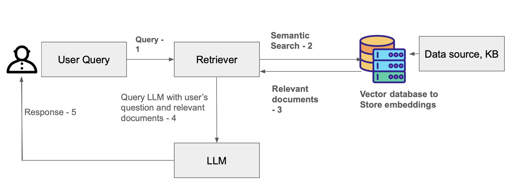
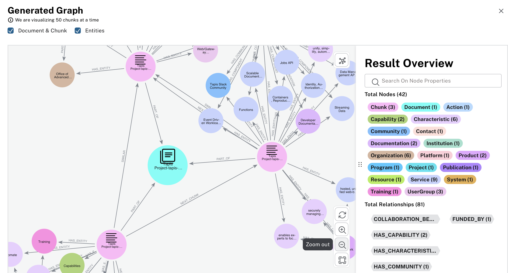

More on RAG 
============

In the previous RAG lecture, we saw how combining retrieval with a language model can produce more accurate, context-specific responses. 
In this follow-up, we dig deeper: we’ll unpack the main architectural components of a full-featured RAG system, understand why and how documents are processed before retrieval, explore more advanced retrieval paradigms (like graph-based RAG), and survey modern frameworks that make building RAG systems easier.

By the end of this module, students should be able to:

* Understand each component in a RAG pipeline;
* Learn preprocessing for your documents (splitting, chunking, embedding, indexing);
* Recognize when to use vector-based or graph-based retrieval;
* Use frameworks to build maintainable, extensible RAG applications;

Examples of Retrieval-Augmented Generation (RAG)
-------------------------------------------------

**Healthcare and Research Assistants**

* Query medical literature and summarize latest research papers.
* Retrieve treatment guidelines from proprietary clinical data.

**Customer Support Chatbots**

* Pull answers from company documentation or ticket history.
* Use retrieved context to generate accurate and personalized support responses.

**Enterprise Knowledge Assistants**

* Access internal wikis, design docs, and project repositories.
* Help employees query domain-specific knowledge without searching manually.

**Legal Document Analysis**

* Extract relevant clauses from long contracts.
* Generate summaries and answer compliance-related questions.

**Code Assistants**

* Answer questions using project-specific codebases and API docs.
* Help developers with accurate debugging suggestions based on the repository.

Core Components of a RAG System 
================================

RAG empowers an LLM to produce grounded, context-aware responses by pulling in information from outside sources. 
This is made possible through a set of architectural components that operate together in a defined workflow. Let's take a closer look at each compoment.

    RAG workflow diagram.

In this RAG workflow, the user submits a query, which is first sent to a retriever. The retriever performs a semantic search over a vector database containing embeddings generated from the knowledge base. It returns the most relevant documents to the retriever, which then sends both the user’s original question and the retrieved documents to the LLM. The LLM uses this combined context to generate an informed response, which is finally delivered back to the user.

Data sources and Knowledge base
~~~~~~~~~~~~~~~~~~~~~~~~~~~~~~~~~

The knowledge base can both contain structured and unstructured data. It could be in a form of CSV files with rows and columns
or it could be a text document like PDF or HTML files. You can also connect your knowledge base to streaming data sources or APIs.
The documents in knowlege base be preproceed and convereted to embeddings for the retrieval to work efficiently. 

A raw document (e.g., a long PDF, research paper, book chapter) may be thousands of words — far exceeding what a LLM can reasonably handle at once.
If you treat entire documents as single units, retrieval will likely retrieve entire documents — which are large, and may contain a lot of irrelevant data, hiding the pertinent details.
Instead, if you divide documents into smaller, **semantically coherent chunks** of text (e.g. 500–2,000 characters, or number-of-sentences), then retrieval returns just a handful of chunks relevant to the query. This improves both precision (less irrelevant text) and efficiency (fewer tokens, faster inference) of the LLM's generated response.
Thus — **document splitting** or **chunking** is fundamental to making RAG practical, scalable, and precise.

In the last lecture, we used several Tapis code generation snippets as documents and generated embeddings for them.
In this section, we will learn how to split these documents into smaller chunks by grouping sentences into fixed-size token blocks, preparing them for more efficient retrieval and RAG processing.

.. code-block:: python3 

    import re

    def chunk_text(text, max_tokens=100):
        # Simple sentence split
        sentences = re.split(r'(?<=[.!?]) +', text.strip())

        chunks = []
        current_chunk = ""

        for sentence in sentences:
            # If adding this sentence exceeds the limit, start a new chunk
            if len(current_chunk.split()) + len(sentence.split()) > max_tokens:
                chunks.append(current_chunk.strip())
                current_chunk = sentence
            else:
                current_chunk += " " + sentence

        # Add the last chunk
        if current_chunk:
            chunks.append(current_chunk.strip())

        return chunks

This code defines a simple text-chunking function that splits a long passage into manageable pieces based on a maximum token (word) limit. It first divides the text into sentences, then iteratively groups those sentences into chunks without exceeding the specified token count. 
When adding a sentence would surpass the limit, a new chunk is started. Finally, the function returns a list of all generated text chunk. 

.. code-block:: python3 

        tapis_documents = [
        "Tapis is an NSF-funded web-based API framework for securely managing computational workloads across infrastructure and institutions, so that experts can focus on their research instead of the technology needed to accomplish it.",
        "As part of work funded by the National Science Foundation starting in 2019, Tapis is delivering a version 3 (“v3”) of its platform with several new capabilities, including a multi-site Security Kernel, Streaming Data APIs, and first-class support for containerized applications.",
        "Python code for generating a Tapis token: from tapipy.tapis import Tapis ...",  # shortened for example
        ]

        # Step 1: Chunk the document
        chunks = chunk_text(doc)
        print(chunks)

.. code-block:: python3 

    Output - > ['Tapis is an NSF-funded web-based API framework for securely managing computational workloads across infrastructure and institutions, so that experts can focus on their research instead of the technology needed to accomplish it. As part of work funded by the National Science Foundation starting in 2019, Tapis is delivering a version 3 (“v3”) of its platform with several new capabilities, including a multi-site Security Kernel, Streaming Data APIs, and first-class support for containerized applications.ine.']

The output shows a list of text chunks generated.

**Embeddings (Vectorization)**
~~~~~~~~~~~~~~~~~~~~~~~~~~~~~~~

Now that we have chunks of fixed length created, we will create embeddings for each chunk. 
Embeddings are the backbone of retrieval. Each chunk is turned into a numerical vector (an embedding) capturing semantic meaning.

You will have to pre-pull the embedding model **nomic-embed-text** by exec-ing into the Ollama container and issuinng command

.. code-block:: python3 

    olama pull nomic-embed-text

When you pull any embedding model (or any model) with Ollama, the model comes packaged with a Manifest file (called a Modelfile) that describes how Ollama should load and run the model.

.. code-block:: python3 

    ollama show --modelfile nomic-embed-text

The code below generates an embedding vector for a given text chunk using a local Ollama API. This embedding can then be used in a RAG system for semantic search or retrieval.

.. code-block:: python3 

    import requests
    import numpy as np

    def embed_with_ollama(text, model="nomic-embed-text"):
        """
        Generate embeddings for a text chunk using Ollama local API.
        Ollama must be running on localhost:11434.
        """
        url = "http://172.17.0.1:11434/api/embed"  
        payload = {
            "model": model,
            "input": text
        }

        response = requests.post(url, json=payload)
        response.raise_for_status() # raises exception if request is not successful
        data = response.json()  #  Python dict

        # Access embeddings directly
        return np.array(data["embeddings"][0])  # single embedding vector

Next, to view chunks and its associated embedding you can use the code below

.. code-block:: python3 

    def process_document_for_rag(text, chunk_size=100, embedding_model="nomic-embed-text"):
        """
        1. Chunk the document
        2. Generate embeddings for each chunk
        3. Return a list of dicts: {"chunk": text, "embedding": vector}
        """
        chunks = chunk_text(text, max_tokens=chunk_size)
        embedded_chunks = []

        for chunk in chunks:
            emb = embed_with_ollama(chunk, model=embedding_model)
            embedded_chunks.append({
                "chunk": chunk,
                "embedding": emb
            })

        return embedded_chunks

.. code-block:: python3 

    if __name__ == "__main__":
    tapis_documents = [
        "Tapis is an NSF-funded web-based API framework ...",
        "As part of work funded by the National Science Foundation ...",
        "Python code for generating a Tapis token: from tapipy.tapis import Tapis ..."
    ]

    rag_chunks = []

    for doc in tapis_documents:
        chunks = process_document_for_rag(doc, chunk_size=20)
        rag_chunks.extend(chunks)

    for i, c in enumerate(rag_chunks):
        print(f"Chunk {i+1}:\n{c['chunk']}\nEmbedding: {(c['embedding'])}\n")

Index / Vector Store
~~~~~~~~~~~~~~~~~~~~~

These embeddings are then stored in a specialized database called a vector store or embedding index, that can supporting efficient similarity queries (nearest neighbors, etc.). This enables rapid retrieval of relevant chunks given a query. 
Some of the popular vector stores are ChromaDB, Neo4j, FAISS (Facebook AI Similarity Search).
**Neo4j** is a graph database but can be combined with vector search for knowledge graph + embedding queries. We will see a short demo on this. 

Key points about vector store are as follows:

**Similarity Search**: Vector stores perform operations like cosine similarity, Euclidean distance, or dot product to find the closest embeddings to a given query vector.
**Scalability**: They are optimized for handling millions or even billions of vectors efficiently.
**Persistence**: Most vector stores can persist embeddings on disk and support incremental updates.

User Query
~~~~~~~~~~~

An input provided by the user can be in various formats such as text, image, code, or other modalities.

The user's query typically triggers two main processes:
* Retrieval: Fetching relevant context or information from a knowledge base, vector store, or database.
* Generation: Producing a response using an LLM or other generative model, often conditioned on the retrieved context.

Retriever
~~~~~~~~~~

We store embeddings of relevant information from external knowledge sources in a vector database. These embeddings serve as the inputs to the retriever, which performs a similarity search to find the most relevant chunks in response to a user query. The retrieved information is then passed to the LLM model to produce a context-aware response.

LLM (Generator)
~~~~~~~~~~~~~~~

The model (e.g., GPT-style or other LLM) receives the embeddings from user's query combined with the embeddings of context retrieved from the vector store. Using these, the LLM generates a response.
 Because the context is drawn from external knowledge sources, the output is more likely to be factually accurate, relevant, and context-aware.

When do we use Vector-based RAG vs Graph-based RAG?
~~~~~~~~~~~~~~~~~~~~~~~~~~~~~~~~~~~~~~~~~~~~~~~~~~~~~

Vector-based RAG works best for searching through large amounts of unstructured data like documents or code. For example, a system that answers questions from a company’s knowledge base uses vector search to find relevant passages quickly. 
Graph-based RAG is better when connections between pieces of information matter, allowing reasoning across linked data—for instance, a biomedical knowledge graph that finds relationships between drugs, genes, and diseases.

Graph-based RAG (Graph RAG)
~~~~~~~~~~~~~~~~~~~~~~~~~~~~

While the **classical** RAG pipeline (documents → split → embed → vector store → retrieve → LLM) works for many tasks, there are scenarios where more sophisticated retrieval / knowledge integration approaches are beneficial.

Graph RAG involves representing knowledge not just as isolated chunks, but as nodes and edges — e.g., entities, relationships, concepts — forming a knowledge graph. Retrieval then becomes graph traversal and semantic search rather than just nearest-neighbor in vector space.
This is especially useful when your data is structured, relational, or has complex interdependencies (e.g., medical records, relational databases, multimodal data, or domains where relationships matter as much as entities).
Graph RAG can help with context coherence, relational reasoning, and reduce hallucinations by grounding answers in structured relationships rather than free-text chunks.

This knowledge graph is built using the Tapis readthedocs. There are several microservices with the Tapis framework that have relationships with each other.

Frameworks build RAG Applications
=================================

`LangChain <https://docs.langchain.com/oss/python/langchain/overview>` : The most popular framework that make building RAG applications super easy. 

LangChain is a widely used framework for building RAG pipelines, chatbots, summarization tools, and more. It provides abstractions for document loading, splitting, embedding generation, vector store integration, retrievers, prompt templates, LLM wrappers, and chaining of operations.
LangaChain can be integrated with OpenAI, Anthropic, `Sambanova <https://sambanova.ai/blog/tacc-deploys-sambanova-suite-ai-inference-for-scientific-research>`

.. code-block:: python3 

    !pip install langchain-sambanova

.. code-block:: python3 

    import getpass
    import os

    if not os.getenv("SAMBANOVA_API_KEY"):
        os.environ["SAMBANOVA_API_KEY"] = getpass.getpass("Enter your SambaNova API key: ")

.. code-block:: python3 

    import os
    import openai

    client = openai.OpenAI(
        api_key=os.environ.get("SAMBANOVA_API_KEY"),
        base_url="https://tejas.tacc.utexas.edu/v1/60709c21-409c-44a5-8a9d-1638fad5d5a6",
    )

    # Function to get a response for a user question
    def ask_question(question: str):
        response = client.chat.completions.create(
            model='Meta-Llama-3.1-405B-Instruct',
            messages=[
                {"role": "system", "content": "You are a helpful assistant."},
                {"role": "user", "content": question}
            ],
            temperature=0.1,
            top_p=0.1
        )
        return response.choices[0].message.content

    # Example: single user input
    user_question = input("Enter your question: ")
    answer = ask_question(user_question)
    print("\nAssistant:", answer)
        

Output -> 
Enter your question:  what is Tapis?

Assistant: Tapis can refer to different things, but here are a few possible meanings:

1. Tapis (textile): Tapis is a type of traditional textile art form that originated in Southeast Asia, particularly in Indonesia and Malaysia. It is a kind of woven cloth, often made from silk or cotton, that features intricate designs and patterns. Tapis textiles are highly valued for their beauty and cultural significance.

2. Tapis (software): Tapis is also the name of a software framework designed for building scalable, distributed applications. It is an open-source platform that provides a set of tools and APIs for developing data-intensive applications, particularly in the fields of science and engineering.

3. Tapis (French word): In French, "tapis" means "carpet" or "rug". It can also refer to a tapestry or a woven wall hanging.

Without more context, it's difficult to determine which definition is most relevant. If you have any additional information or clarification, I'd be happy to try and provide a more specific answer.

